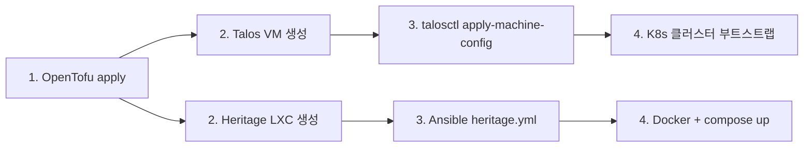

# Homelab Proxmox IaC Design

> **상태**: Draft
> **대상**: walle (AOOSTAR WTR R1, Intel N100, 8GB RAM, 2TB) — Proxmox VE

## 개요

회사 Proxmox K8s 클러스터(`opshub`)의 축소 재현. 각 컴포넌트 타입별 1개씩 구성하여 IaC(OpenTofu + Ansible) 학습 및 heritage 미디어 서버 배포.

## 아키텍처

```mermaid
graph TD
    INET[Internet]
    ARV[arv - GL.iNet Beryl AX]
    WALLE[walle - Proxmox VE]
    MASTER[VM 100: talos-master]
    WORKER[VM 101: talos-worker]
    HERITAGE[LXC 200: heritage]

    INET --- ARV
    ARV --- WALLE
    WALLE --- MASTER
    WALLE --- WORKER
    WALLE --- HERITAGE

    HERITAGE --- DATA1[/mnt/data1 - Inbound Staging]
    HERITAGE --- DATA2[/mnt/data2 - The Vault]
```

### 리소스 분배

| 리소스 | Proxmox 호스트 | talos-master | talos-worker | heritage LXC | 합계 |
| :--- | :--- | :--- | :--- | :--- | :--- |
| RAM | ~1G | 1.5G | 2.5G | 1.5G | 6.5G / 8G |
| vCPU | - | 2 | 2 | 2 | 6 / 4T |
| Disk | - | 20G | 30G | 50G | 100G / 2TB |

### 네트워크

- **브릿지**: `vmbr0` (단일)
- **IP**: DHCP (arv 라우터에서 할당, 192.168.221.0/24)
- **외부 접속**: Tailscale (heritage LXC)

## 컴포넌트

### VM 100: talos-master

- **OS**: Talos Linux
- **역할**: K8s control-plane (단일 마스터)
- **리소스**: 2C / 1.5G / 20G
- **프로비저닝**: OpenTofu (VM 생성) → talosctl (machine config 적용)

### VM 101: talos-worker

- **OS**: Talos Linux
- **역할**: K8s worker
- **리소스**: 2C / 2.5G / 30G
- **프로비저닝**: VM 100과 동일

### LXC 200: heritage

- **OS**: Debian 12
- **역할**: 미디어 서버 (Docker Compose)
- **리소스**: 2C / 1.5G + 512M swap / 50G
- **특징**: nesting 활성화, bind mount (`/mnt/data1`, `/mnt/data2`)
- **프로비저닝**: OpenTofu (LXC 생성) → Ansible (Docker + heritage 배포)
- **서비스**: Homepage, Tailscale, Caddy, Prowlarr, FlareSolverr, Transmission, Whisparr, Stash, Jellyfin, Gatus, Beszel

## Repo 구조

```
homelab/
├── proxmox/
│   ├── opentofu/
│   │   ├── main.tf           # provider, locals
│   │   ├── variables.tf      # 입력 변수
│   │   ├── outputs.tf        # VM/LXC IP 출력
│   │   ├── talos.tf          # Talos VM 리소스 (master + worker)
│   │   ├── heritage.tf       # Heritage LXC 리소스
│   │   └── templates.tf      # 템플릿 data 소스
│   └── ansible/
│       ├── inventory/
│       │   └── hosts.ini     # OpenTofu output 기반
│       ├── playbooks/
│       │   ├── heritage.yml        # LXC: Docker + heritage 배포
│       │   └── talos-bootstrap.yml # talosctl 초기화 보조
│       └── ansible.cfg
├── k8s/
│   ├── talconfig.yaml        # Talos 클러스터 설정 (talhelper)
│   └── manifests/            # K8s 애드온 매니페스트
├── docs/
│   └── architecture.md
├── .sops.yaml                # secrets 암호화 (기존 age 키 재사용)
├── .gitignore
└── README.md
```

## 도구 역할 분담

| 도구 | 역할 | 대상 |
| :--- | :--- | :--- |
| **OpenTofu** | VM/LXC 프로비저닝, 리소스 라이프사이클 | Proxmox API (`bpg/proxmox` v0.70+) |
| **talosctl / talhelper** | Talos 노드 초기화, K8s 클러스터 부트스트랩 | Talos VM |
| **Ansible** | LXC OS 설정, Docker/heritage 배포, post-provisioning | Heritage LXC |

## 워크플로우



1. **OpenTofu apply**: VM 2대 + LXC 1대 생성
2. **Talos 부트스트랩**: `talosctl`로 machine config 적용 → K8s 클러스터 초기화
3. **Ansible**: heritage LXC에 Docker 설치 → heritage repo clone → `docker compose up`

## Talos 템플릿 준비 (사전 작업)

TalOS ISO를 Proxmox에 수동으로 템플릿화:

```bash
# 1. Talos ISO 다운로드 (proxmox.it)
# 2. Proxmox Web UI에서 VM 생성 (VM ID: 900, BIOS: SeaBIOS)
# 3. Talos ISO로 부팅 후 템플릿 변환
# 4. OpenTofu에서 data 소스로 참조
```

## Secrets 관리

- **Proxmox API Token**: sops로 암호화 (`secrets.sops.yaml`)
- **heritage `.env`**: 기존 heritage repo의 sops 암호화 유지
- **age 키**: 기존 dotfiles `.sops.yaml`의 age 키 재사용
- **Talos secrets**: `talosctl gen secrets`로 생성, sops로 암호화하여 repo에 보관

## 회사 opshub와의 대응关系

| 회사 (opshub) | 홈랩 (homelab) | 비고 |
| :--- | :--- | :--- |
| 7노드 Proxmox 클러스터 | 1노드 (walle) | 단일 노드 |
| kubeadm on Ubuntu | Talos Linux | 불변 OS |
| SDN (EVPN VXLAN) | vmbr0 + DHCP | 단일 브릿지 |
| Ceph (rbd-hdd, rbd-nvme) | local-lvm | 로컬 스토리지 |
| Master 3 + Worker 4+ | Master 1 + Worker 1 | 최소 구성 |
| HAProxy LB | 없음 | 단일 마스터 |
| GPU Passthrough | 없음 | N100 GPU 없음 |
| Ansible (예정) | Ansible | heritage LXC 관리 |

## 향후 확장

- K8s worker 추가 (다른 호스트에 Proxmox 설치 시)
- kubeadm 클러스터 구축 (회사 환경 실습)
- Longhorn 분산 스토리지
- MetalLB, Traefik ingress
