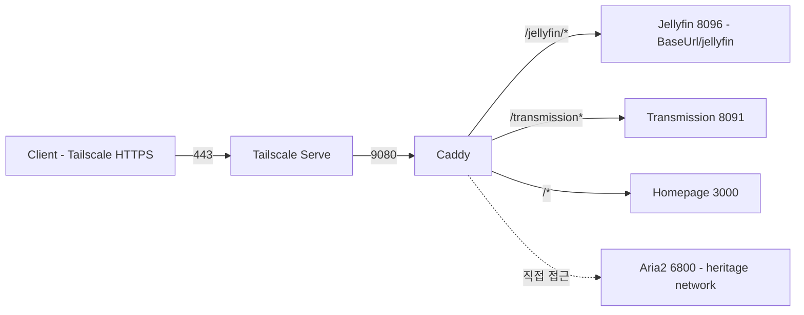

# Traefik → Caddy 마이그레이션 설계

**날짜**: 2026-06-08
**목표**: Traefik을 Caddy로 교체하여 `proxy_redirect` 지원 (base path 미지원 앱 대응)

## 아�키텍처

### 변환 전
```
Client (HTTPS) → Tailscale Serve(443→9080) → Traefik(v3, :9080) → 각 서비스
```

### 변환 후
```
Client (HTTPS) → Tailscale Serve(443→9080) → Caddy(:9080) → 각 서비스
```

### 구성도



## 컴포넌트

### Caddy 컨테이너

```yaml
services:
  caddy:
    image: caddy:latest
    container_name: caddy
    restart: unless-stopped
    network_mode: host
    volumes:
      - ./caddy/Caddyfile:/etc/caddy/Caddyfile:ro
      - caddy_data_data:/data
      - caddy_config_data:/config
```

**설계 결정**:
- `network_mode: host`: 현재 서비스들과 호환, 로컬 포트 직접 접근
- 볼륨 마운트: 디렉터리 단위 (`./caddy:/etc/caddy:ro`) 권장 (편집 시 inode 교체 문제 방지)
- `/data`, `/config`: 상태 영속화 (자동 TLS용, 현재는 Tailscale가 TLS 처리)

### Caddyfile

```
:9080 {
    # Jellyfin (Base URL 설정 필요)
    redir /jellyfin /jellyfin/
    handle /jellyfin/* {
        reverse_proxy localhost:8096
    }

    # Transmission (prefix 유지)
    handle /transmission* {
        reverse_proxy localhost:8091
    }

    # Homepage (catch-all)
    handle {
        reverse_proxy localhost:3000
    }
}
```

**설계 결정**:
- `handle_path` 대신 `handle`: prefix 보존 (Jellyfin `BaseUrl` 설정 필요)
- `/jellyfin` → `/jellyfin/` redirect: trailing slash 강제
- Aria2: 현재 Tailscale 내부에서 직접 `localhost:6800` 사용 → Caddy 라우팅 불필요

### Jellyfin 설정 변경

```yaml
environment:
  - JELLYFIN_BaseUrl=/jellyfin  # 빈값에서 변경
```

### 삭제 항목

- `traefik` 서비스 전체
- `heritage/traefik/` 디렉터리 (`traefik.yml`, `dynamic.yml`)

## 데이터 플로우

### 요청 흐름

```
User (HTTPS)
  ↓ Tailscale Serve (443→9080, TLS 종료)
  ↓ Caddy (:9080, HTTP 수신)
  ↓
[경로 매칭]
  ├─ /jellyfin/* → localhost:8096 (BaseUrl=/jellyfin)
  ├─ /transmission* → localhost:8091
  └─ /* → localhost:3000 (Homepage)
```

### HTTP 헤더 처리

**Caddy 기본 헤더** (자동 추가):
- `X-Forwarded-For`: 클라이언트 IP
- `X-Forwarded-Proto`: `http` (Caddy는 9080에서 HTTP 수신)
- `X-Forwarded-Host`: 요청 Host 헤더

**Tailscale Serve → Caddy**:
- TLS는 Tailscale에서 종료 → Caddy는 HTTP로 수신
- 원본 HTTPS 정보는 Tailscale 헤더로 전달 가능 (현재 미사용)

## 에러 핸들링

### Caddy 기본 동작

- 매칭 실패: `404 Not Found`
- Upstream 연결 실패: `502 Bad Gateway`

### 마이그레이션 리스크

| 시나리오 | 동작 | 사용자 경험 |
| :--- | :--- | :--- |
| Homepage 다운 | Caddy → 502 | 대시보드 접속 실패 |
| Jellyfin 다운 | `/jellyfin/*` → 502 | 스트리밍 불가 |
| Caddy 다운 | Tailscale Serve → 502 | 전체 서비스 장애 |

### 다운타임

- **단계**: `docker compose up`으로 Traefik 중지 → Caddy 시작
- **예상**: ~10초
- **롤백**: `git`으로 원래 `compose.yml` 복구 후 재시작

## 테스트

### Caddyfile 문법 검증

```bash
docker run --rm -v "$PWD/caddy:/etc/caddy" caddy validate --config /etc/caddy/Caddyfile
```

### 기능 테스트

| 테스트 | 명령어 | 예상 결과 |
| :--- | :--- | :--- |
| Homepage 접근 | `curl -i http://localhost:9080/` | 200 OK |
| Jellyfin 루트 | `curl -i http://localhost:9080/jellyfin/` | 200 또는 redirect |
| Jellyfin 정적 자 | `curl -i http://localhost:9080/jellyfin/main.js` | 200 (404 없어야) |
| Transmission Web UI | `curl -i http://localhost:9080/transmission/web/` | 200 OK |
| Tailscale 외부 접근 | `curl -i https://heritage.bun-bull.ts.net/` | 200 OK |

### 통합 테스트

1. **클라이언트 측 테스트**: 브라우저에서 `/jellyfin`, `/transmission` 접근 후 DevTools Network로 JS/CSS/XHR 경로 확인 (`/`로 새지 않아야)
2. **Jellyfin 설정**: `JELLYFIN_BaseUrl=/jellyfin` 적용 후 재시작
3. **다운타임 측정**: `time docker compose up -d caddy` 실행 → 교체 시간 확인

## 검증 결과 (Codex + Gemini)

### [Blocker] 해결

- **`handle_path` 대신 `handle`**: 두 에이전트 모두 prefix 보존 권장
  - Jellyfin: `Base URL=/jellyfin` 설정 필요
  - Transmission: `/transmission/rpc` 경로 보존

### [Risk] 완화

- **패턴 명시화**: `/jellyfin/*`, `/transmission/*`로 명시 (너무 넓은 `/foo*` 방지)
- **Aria2 직접 접근**: 현재 `localhost:6800` 사용 중 → Caddy 라우팅 불필요

### [Safe] 확인

- **network_mode: host 호환**: 두 에이전트 모두 호환성 확인
- **Caddy 기본 헤더**: `X-Forwarded-*` 자동 처리
- **Aria2 접근**: bridge 네트워크여도 `localhost:6800` 접근 가능

## 구현 범위

- [ ] `heritage/caddy/Caddyfile` 생성
- [ ] `heritage/compose.yml` 수정 (traefik → caddy, Jellyfin BaseUrl 추가)
- [ ] `heritage/traefik/` 디렉터리 삭제
- [ ] Caddy 컨테이너 배포 및 검증
- [ ] CLAUDE.md 업데이트 (서비스 URL, 운영 명령어)
