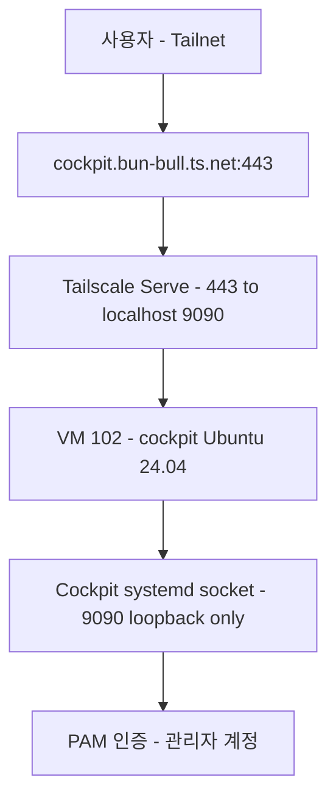
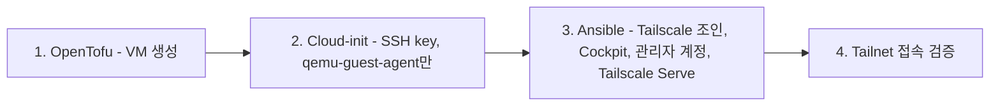

# Cockpit 도입 Design

> **Source**: 본 문서는 homelab IaC 레포의 첫 모니터링/관리 도구 도입 design. 회사 서버 적용 전 사전 테스트가 1차 목적.
>
> **검증 이력 (2026-07-05):** Codex(gpt-5.5) + Antigravity(Gemini 3.1 Pro High) 2-way 교차검증 완료. Blocker 3건, Risk 8건 반영 (하단 [검증 이력](#검증-이력) 섹션 참조).

## 목차

- [배경 및 목적](#배경-및-목적)
- [아키텍처](#아키텍처)
- [OpenTofu — VM 리소스](#opentofu--vm-리소스)
- [Ansible — Cockpit 배포](#ansible--cockpit-배포)
- [노출 및 인증 전략](#노출-및-인증-전략)
- [회사 서버 적용 시 차이점](#회사-서버-적용-시-차이점)
- [검증 계획](#검증-계획)
- [Out of Scope](#out-of-scope)
- [검증 이력](#검증-이력)

## 배경 및 목적

- **1차 목적:** 회사 서버 모니터링/관리 도구 도입 전, homelab에서 사전 검증
- **재현성:** 동일 Ansible playbook을 회사 Ubuntu 서버에 그대로 적용 가능해야 함
- **범위:** Cockpit만 단독 진행 (PatchMon, Pulse는 별도 design)

Cockpit 선택 이유: 단일 호스트 웹 관리 UI로 복잡도 최하, 회사 서버 범용, 호스트 직접 설치 원칙(LXC 부적합).

## 아키텍처



```
walle (Proxmox VE 9.2)
└── VM 102: cockpit (Ubuntu 24.04 LTS, Tailscale 조인)
    ├── Cockpit (systemd socket, :9090 — loopback만)
    └── Tailscale Serve (443 → https+insecure://localhost:9090)
```

**프로비저닝 흐름:**



> cloud-init은 최소(SSH 키, qemu-guest-agent)로 축소 — Tailscale 조인, 관리자 계정, 비밀번호는 모두 Ansible이 담당. 회사 서버(cloud-init 없음)에서도 동일 playbook이 동작하도록.

## OpenTofu — VM 리소스

### 신규 파일: `proxmox/opentofu/cockpit.tf`

VM ID 102(talos 100/101 다음). Ubuntu 24.04 LTS cloud image(qcow2) 기반. bpg/proxmox `~> 0.111` provider 사용 (기존 repo 패턴).

| 속성 | 값 | 비고 |
|:---|:---|:---|
| resource type | `proxmox_virtual_environment_vm` | bpg provider (구 `proxmox_vm_qemu` 금지) |
| vm_id | 102 | talos 100/101 다음 (live 충돌은 `tofu plan`/API로 사전 확인) |
| name | cockpit | |
| vcpu | 2 | `cpu { cores = 2, type = "host" }` (talos 패턴) |
| memory | 4096 | 4GB |
| disk | 30GB | scsi0, local-lvm |
| os image | Ubuntu 24.04 LTS cloud image | **`download_file` 리소스로 자동 다운로드** 또는 고정 `file_id` 명시 (수동 업로드 지양) |
| started | true | 일반 Linux라 QEMU guest agent 정상 |
| agent | `agent { enabled = true }` | bpg schema (구 `guest_agent = true` 금지) |
| wait_for_ip | `ipv4_addresses` 조회 시 agent 동기화 명시 | apply hang 방지 |
| network | `network_device { bridge = "vmbr0" }` | talos와 동일 패턴, DHCP |

### Cloud-init (초기 부팅, 최소화)

cloud-init은 **초기 SSH 접근 확보용만** 담당. 서비스 설정은 Ansible이 담당 (재실행 가능, drift 관리, 회사 서버 동일 playbook).

- 기본 관리자 계정 (예: `ubuntu` 또는 `debian`) — 사전 정의 SSH 공개키 추가
- `qemu-guest-agent` 패키지 설치 (agent 기반 IP 인식 선행 조건)
- APT 패키지 캐시 업데이트

> **비밀번호, Tailscale auth key, cockpit-admin 계정은 cloud-init에서 다루지 않음** — 모두 Ansible + sops로 분리 (Terraform state에 평문 파생값 잔류 방지, 회사 서버 재현성).

### variables.tf 추가 (object 패턴, talos/heritage 일관)

```hcl
variable "cockpit_vmid" {
  type    = number
  default = 102
}

variable "cockpit_resources" {
  type = object({
    cores  = number
    memory = number
    disk   = number
  })
  default = {
    cores  = 2
    memory = 4096
    disk   = 30
  }
}

variable "cockpit_image_file_id" {
  type        = string
  description = "Ubuntu 24.04 cloud image file ID (local:snippets/ubuntu-24.04.qcow2 등)"
}
```

### outputs.tf 추가 (bpg provider schema)

```hcl
output "cockpit_vm_id" {
  value       = proxmox_virtual_environment_vm.cockpit.vm_id
  description = "cockpit VM ID"
}

output "cockpit_ipv4" {
  # agent 활성화 후 ipv4_addresses에서 첫 비제어 IP 추출
  value       = proxmox_virtual_environment_vm.cockpit.ipv4_addresses[1][0]
  description = "cockpit VM IPv4 주소 (agent 기반)"
}

output "cockpit_mac" {
  value       = proxmox_virtual_environment_vm.cockpit.mac_addresses[0]
  description = "cockpit VM MAC 주소"
}
```

## Ansible — Cockpit 배포

### inventory/hosts.ini — 신규 그룹

```ini
[cockpit_hosts]
cockpit ansible_host=<VM_IP> ansible_user=<bootstrap_user>
```

> CLAUDE.md "플레이북과 그룹명 1:1 매핑" 규칙 준수 (`cockpit_hosts` ↔ `cockpit.yml`). `<VM_IP>`는 DHCP 결과로 갱신 (Gotcha).

### playbooks/cockpit.yml — 신규 playbook

```yaml
- name: Deploy Cockpit
  hosts: cockpit_hosts
  become: true
  roles:
    - role: cockpit
```

### roles/cockpit/ 구조

```
roles/cockpit/
├── tasks/
│   ├── main.yml              # 패키지 설치, socket 활성화, UFW
│   ├── tailscale_join.yml    # Tailscale 설치/조인 (auth key sops)
│   ├── auth.yml              # 관리자 계정 생성, sudoers, PAM
│   └── tailscale_serve.yml   # Tailscale Serve 443→9090 (conditional, idempotent)
├── defaults/main.yml         # 변수 기본값
├── handlers/main.yml         # 서비스 재시작
└── templates/                # 설정 템플릿 (필요시)
```

### 주요 태스크

1. **패키지 + 방화벽 (`main.yml`)**
   - `cockpit` 패키지 설치 (Ubuntu repo)
   - `cockpit.socket` 활성화/시작
   - **Cockpit socket을 127.0.0.1:9090으로 바인딩 제한** (`/etc/systemd/system/cockpit.socket.d/override.conf`로 `ListenStream=` 재정의) — 외부 인터페이스 노출 차단
   - UFW: `tailscale0` 인터페이스만 허용, vmbr0/LAN의 9090은 명시적 deny. 9090은 기본적으로 loopback만 허용하므로 443(Tailscale Serve) 노출 불필요

2. **Tailscale 조인 (`tailscale_join.yml`)** — cloud-init에서 이관
   - Tailscale 패키지 설치
   - `tailscale up --authkey={{ tailscale_auth_key }}` (auth key는 sops)
   - heritage LXC 패턴과 일관

3. **인증 (`auth.yml`)** — 회사 서버에서도 동일 동작
   - **Ansible이 동적으로 `cockpit-admin` 계정 생성** (`user` module, 비밀번호는 sops hash)
   - 비밀번호는 **`proxmox/ansible/secrets.sops.yaml` (Ansible 전용, 신규)** 에 `cockpit_admin_password` 키로 저장 — OpenTofu `secrets.sops.yaml`과 분리 (TF state 평문 파생값 잔류 방지)
   - sudoers: **passworded sudo** (NOPASSWD 지양). `/etc/sudoers.d/cockpit-admin`에 `cockpit-admin ALL=(ALL) ALL` — Cockpit 웹 로그인 탈취 시 즉시 root escalation 방지
   - Cockpit은 PAM 기반 (별도 인증 DB 없음)
   - SSH: 비밀번호 로그인 금지, 키만 허용

4. **Tailscale Serve (`tailscale_serve.yml`)** — idempotent + 올바른 스킴
   - **목적지 스킴: `https+insecure://localhost:9090`** (Cockpit 자가서명 TLS 백엔드, CLAUDE.md Gotcha 준수)
   - idempotency: `command: tailscale serve status` 결과를 `register` 후, 원하는 매핑과 다를 때만 `tailscale serve --bg --https=443 https+insecure://localhost:9090` 실행 (`changed_when`/`when` 적용, walle.yml 패턴)
   - `tailscale funnel`은 사용 안 함 (Tailnet 내부만 노출)
   - `when: cockpit_tailscale_serve | bool` — 회사 서버에선 `false`

### defaults/main.yml

```yaml
cockpit_tailscale_serve: true       # homelab: true, 회사 서버: false
cockpit_admin_user: cockpit-admin
cockpit_listen_port: 9090
cockpit_bind_loopback_only: true    # socket을 127.0.0.1로 제한
cockpit_sudo_nopasswd: false        # passworded sudo (기본)
# 회사 서버 변수화 (R8)
cockpit_reverse_proxy: false        # 회사 서버: 기존 reverse proxy 사용 시 true
cockpit_manage_firewall: true       # 회사 서버: 기존 방화벽 규칙 존중 시 false
```

## 노출 및 인증 전략

### 노출

- **URL:** `https://cockpit.bun-bull.ts.net` (Tailscale Serve 443→9090)
- **TLS:** Tailscale이 종료 (heritage와 동일 패턴)
- **백엔드 스킴:** `https+insecure://localhost:9090` (Cockpit 자가서명 인증서, CLAUDE.md Gotcha)
- **9090 외부 노출:** 금지. Cockpit socket을 loopback으로 제한 + UFW로 차단. Tailscale Serve만 유일한 진입점.
- **heritage Caddy와 분리:** Cockpit은 WebSocket/복잡 경로(`/cockpit/`, `/system/`)를 써서 path-based 라우팅 부적합. 독립 서브도메인으로 노출.

### 인증

- PAM 기반 Linux 계정 인증
- 관리자 계정 비밀번호는 **`proxmox/ansible/secrets.sops.yaml` (Ansible 전용)** 로 관리
- passworded sudo (NOPASSWD 지양)
- SSH 키 기반 로그인만 허용 (비밀번호 SSH 로그인 금지)

## 회사 서버 적용 시 차이점

| 항목 | homelab | 회사 서버 |
|:---|:---|:---|
| VM 프로비저닝 | OpenTofu | (이미 프로비저닝됨) |
| 초기 설정 | cloud-init (최소) | (이미 됨) |
| Cockpit 배포 | Ansible | **동일 Ansible** |
| 관리자 계정 생성 | Ansible (동적) | **동일** |
| sudo 정책 | passworded | **동일** |
| Tailscale Serve | `cockpit_tailscale_serve: true` | `false` |
| 노출 | Tailscale Serve | `cockpit_reverse_proxy: true` (기존 reverse proxy) |
| 방화벽 | UFW (Ansible 관리) | `cockpit_manage_firewall: false` (기존 규칙 존중) |

 toggle 하나가 아니라 **4개 변수**(`cockpit_tailscale_serve`, `cockpit_reverse_proxy`, `cockpit_manage_firewall`, bootstrap user)로 회사 서버 환경을 명시적으로 제어 (R8 반영).

## 검증 계획

### OpenTofu

1. `tofu validate` → verify: bpg schema 통과 (`proxmox_virtual_environment_vm`, `agent` 블록, `ipv4_addresses`)
2. `tofu plan` → verify: VM 102 create 1개, destroy 0개, live VM ID 충돌 없음
3. `tofu apply` → verify: VM 102 running, agent 통해 IP 획득 (apply hang 없음)

### Ansible

1. `ansible-playbook playbooks/cockpit.yml --check` → verify: dry-run 성공
2. 1차 실제 적용 → verify: `cockpit.socket` active, loopback 바인딩, 사용자 생성
3. **2차 실행** → verify: changed 0 (idempotency, `tailscale serve status` 기반)
4. `curl -sk https://localhost:9090` → verify: 200 응답
5. `tailscale serve status` → verify: 443→9090 매핑 (`https+insecure://`)

### End-to-End

1. `https://cockpit.bun-bull.ts.net` 접속 → verify: Cockpit 로그인 페이지 (502 없음)
2. 관리자 계정 로그인 → verify: 대시보드 정상, systemd/저널/패키지 섹션 동작
3. sudo 실행 시 비밀번호 프롬프트 → verify: passworded sudo 동작

### Security

1. 외부 호스트에서 `nc -zv <VM_LAN_IP> 9090` → verify: 연결 거부 (loopback만)
2. Tailnet 다른 호스트에서 `nc -zv <VM_TAILSCALE_IP> 9090` → verify: 연결 거부 (Tailscale Serve 443만)
3. `ssh cockpit-admin@<VM> -o PasswordAuthentication=no` → verify: 키 없으면 거부

## Out of Scope

- PatchMon, Pulse 도입 (별도 design) — 단, **OS는 세 프로젝트 모두 Ubuntu 24.04 LTS로 통일** (회사 서버 모방/재현성)
- 세 프로젝트를 한 VM에 통합 설치할지 별도 VM으로 분리할지는 각 도구 design 시점에 결정. 현재는 Cockpit 단독 VM(4GB)만 진행 (KISS/YAGNI). 4GB 메모리는 PatchMon/Pulse 중앙 역할 확장 여지를 둔 여유분
- Cockpit 다중 호스트 관리 (여러 VM 등록) — 단일 호스트 자체 관리만
- Cockpit Podman/Docker 모듈 (필요시 추후)
- 회사 서버 실제 적용 (homelab 검증 완료 후 별도 진행)

## 검증 이력

### 2026-07-05 — Codex(gpt-5.5) + Antigravity(Gemini 3.1 Pro High) 2-way 교차검증

두 에이전트가 서로의 결과를 보지 않고 독립 검색·검증. Claude가 판사로 취합.

**Blocker 3건 (반영 완료):**
- B1: outputs/리소스가 구 provider `proxmox_vm_qemu` 사용 → bpg `proxmox_virtual_environment_vm` + `ipv4_addresses`로 정정 (양쪽 합의)
- B2: `guest_agent = true`는 bpg schema 아님 → `agent { enabled = true }` 블록 + `wait_for_ip` 명시 (양쪽 합의, Codex가 apply hang 타이밍 이슈 추가)
- B3: Tailscale Serve 목적지 `http://localhost:9090` → `https+insecure://localhost:9090` 필수 (Antigravity 단독 발견, CLAUDE.md Gotcha로 검증 → 반영)

**Risk 8건 (반영 완료):**
- R1: 9090 이중 노출 → Cockpit socket loopback 바인딩 + UFW vmbr0 deny (양쪽)
- R2: 비밀번호 TF state 잔류 → `proxmox/ansible/secrets.sops.yaml` 분리 (양쪽)
- R3: sudo NOPASSWD 위험 → passworded sudo (양쪽)
- R4: `tailscale serve` idempotency → status 기반 conditional (양쪽)
- R5: cloud-init 의존 → Ansible 동적 사용자 생성 + cloud-init 축소 (Antigravity)
- R6: cloud image 재현성 → `download_file`/고정 `file_id` (Codex)
- R7: flat 변수 → `cockpit_resources` object 패턴 (Antigravity)
- R8: 회사 서버 과소명세 → 4개 변수로 명시적 제어 (Codex)

**Assumption 검증:** VM ID 102 충돌(repo 기준 없음, live 확인 필요), Ubuntu 24.04 Cockpit 패키지/socket/PAM 호환 (양쪽)
