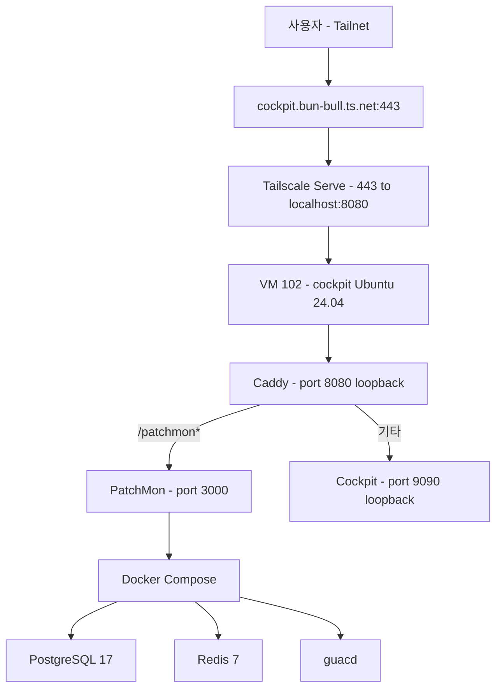
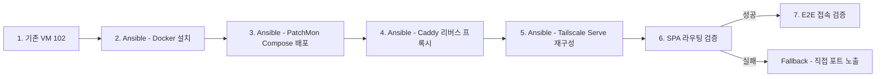

# PatchMon 도입 Design

> **Source**: 본 문서는 homelab IaC 레포의 두 번째 모니터링/관리 도구 도입 design. 회사 서버 적용 전 사전 테스트가 1차 목적. Cockpit(VM 102) 완료 후 후속.
>
> **검증 이력:** TBD (2-way 검증 예정)

## 목차

- [배경 및 목적](#배경-및-목적)
- [아키텍처](#아키텍처)
- [Docker 및 PatchMon 배포](#docker-및-patchmon-배포)
- [Caddy 리버스 프록시](#caddy-리버스-프록시)
- [Ansible — cockpit role 확장](#ansible--cockpit-role-확장)
- [시크릿 관리](#시크릿-관리)
- [노출 및 인증 전략](#노출-및-인증-전략)
- [회사 서버 적용 시 차이점](#회사-서버-적용-시-차이점)
- [검증 계획](#검증-계획)
- [Out of Scope](#out-of-scope)
- [검증 이력](#검증-이력)

## 배경 및 목적

- **1차 목적:** 회사 서버 패치 모니터링 도구 도입 전, homelab에서 사전 검증
- **재현성:** 동일 Ansible playbook을 회사 Ubuntu 서버에 그대로 적용 가능해야 함
- **범위:** PatchMon만 단독 진행 (Pulse는 별도 design)
- **의사결정:** Cockpit VM(102)에 통합 배포 (신규 VM 불필요). Docker Compose로 PatchMon 4컨테이너 실행. Caddy를 로컬 리버스 프록시로 사용.

PatchMon 선택 이유: 엔터프라이즈급 패치 모니터링 + Proxmox LXC auto-enrollment + outbound-only agent 모델 (방화벽 친화적). Docker 배포로 회사 Ubuntu 서버 재현성 확보.

## 아키텍처



```
VM 102: cockpit (Ubuntu 24.04 LTS, Tailscale 조인)
├── Cockpit (systemd socket, :9090 loopback)          # 기존
├── Docker Engine                                       # 신규
│   └── PatchMon Compose (4 containers)                 # 신규
│       ├── server (ghcr.io/patchmon/patchmon-server, :3000)
│       ├── database (postgres:17-alpine, volume)
│       ├── redis (redis:7-alpine, volume)
│       └── guacd (guacamole/guacd, :4822 internal)
├── Caddy (port 8080, local reverse proxy)              # 신규
│   ├── /patchmon* → localhost:3000
│   └── /* → https://localhost:9090 (Cockpit)
└── Tailscale Serve (443 → http://localhost:8080)       # 재구성
```

**프로비저닝 흐름:**



> OpenTofu 변경 없음 — VM 102은 이미 프로비저닝됨. Ansible만으로 배포 (기존 cockpit role 확장).

**리소스:** VM 102 (4GB RAM, 2 vCPU, 30GB disk). Cockpit ~100MB, Docker overhead ~100MB, PatchMon 4컨테이너 ~1.5-2GB. 여유분 충분.

## Docker 및 PatchMon 배포

### Docker Engine 설치 (`docker.yml`)

- Docker official apt repo 사용 (Ubuntu docker.io 아님)
- 패키지: `docker-ce`, `docker-ce-cli`, `containerd.io`, `docker-compose-plugin`
- `when: cockpit_patchmon_enabled | bool` — 비활성화 시 Docker 설치 스킵
- 설치 후 `docker compose version` 확인 태스크

### PatchMon Compose 배포 (`patchmon.yml`)

- 배포 경로: `/opt/patchmon/`
- `docker-compose.yml`은 Ansible template으로 관리 (PatchMon 공식 compose 기반, 이미지 태그 변수화)
- `.env`는 `patchmon.env.j2` template → 시크릿은 Ansible 변수에서 주입 (sops 경유)
- `docker compose up -d --wait` (healthcheck 대기 후 완료)
- 볼륨: Docker named volumes (`postgres_data`, `redis_data`) — VM 재시작 후 데이터 유지

### docker-compose.yml (Ansible template)

```yaml
name: patchmon

services:
  server:
    image: ghcr.io/patchmon/patchmon-server:{{ cockpit_patchmon_version }}
    restart: unless-stopped
    env_file: .env
    ports:
      - "3000:3000"
    networks:
      - patchmon-internal
    depends_on:
      database:
        condition: service_healthy
      redis:
        condition: service_healthy
      guacd:
        condition: service_healthy
    logging:
      driver: "json-file"
      options:
        max-size: "10m"
        max-file: "3"

  database:
    image: postgres:17-alpine
    restart: unless-stopped
    env_file: .env
    volumes:
      - postgres_data:/var/lib/postgresql/data
    networks:
      - patchmon-internal
    healthcheck:
      test: ["CMD-SHELL", "pg_isready -U ${POSTGRES_USER} -d ${POSTGRES_DB}"]
      interval: 3s
      timeout: 5s
      retries: 7
    logging:
      driver: "json-file"
      options:
        max-size: "10m"
        max-file: "3"

  redis:
    image: redis:7-alpine
    restart: unless-stopped
    env_file: .env
    command: redis-server --requirepass ${REDIS_PASSWORD}
    volumes:
      - redis_data:/data
    networks:
      - patchmon-internal
    healthcheck:
      test: ["CMD", "redis-cli", "--no-auth-warning", "-a", "${REDIS_PASSWORD}", "ping"]
      interval: 3s
      timeout: 5s
      retries: 7
    logging:
      driver: "json-file"
      options:
        max-size: "10m"
        max-file: "3"

  guacd:
    image: guacamole/guacd:latest
    restart: unless-stopped
    read_only: true
    tmpfs:
      - /tmp:size=64m
    security_opt:
      - no-new-privileges:true
    cap_drop:
      - ALL
    mem_limit: 512m
    cpus: '1.0'
    networks:
      - patchmon-internal
    healthcheck:
      test: ["CMD-SHELL", "nc -z localhost 4822 || exit 1"]
      interval: 10s
      timeout: 5s
      retries: 3
      start_period: 10s
    logging:
      driver: "json-file"
      options:
        max-size: "10m"
        max-file: "3"

volumes:
  postgres_data:
  redis_data:

networks:
  patchmon-internal:
    driver: bridge
```

### patchmon.env.j2 (핵심 변수만, 전체는 env.example 참조)

```env
# CORS_ORIGIN — Tailscale 도메인 (CORS용)
CORS_ORIGIN={{ cockpit_patchmon_cors_origin }}
TRUST_PROXY=true

# Database
POSTGRES_HOST=database
POSTGRES_PASSWORD={{ patchmon_postgres_password }}
POSTGRES_USER=patchmon_user
POSTGRES_DB=patchmon_db
DATABASE_URL=postgresql://patchmon_user:{{ patchmon_postgres_password }}@database:5432/patchmon_db

# Redis
REDIS_HOST=redis
REDIS_PORT=6379
REDIS_PASSWORD={{ patchmon_redis_password }}

# Secrets
JWT_SECRET={{ patchmon_jwt_secret }}
SESSION_SECRET={{ patchmon_session_secret }}
AI_ENCRYPTION_KEY={{ patchmon_ai_encryption_key }}

# Guacamole (RDP)
GUACD_ADDRESS=guacd:4822
```

## Caddy 리버스 프록시

### 설치 (`caddy.yml`)

- Caddy official apt repo
- `when: cockpit_caddy_enabled | bool`

### Caddyfile (template)

```
{
    admin off
}

:8080 {
    handle_path /patchmon* {
        reverse_proxy localhost:3000
    }

    handle {
        reverse_proxy https://localhost:9090 {
            transport http {
                tls_insecure_skip_verify
            }
        }
    }
}
```

- `handle_path` — `/patchmon` prefix를 strip 후 PatchMon에 전달 (PatchMon은 root에서 요청 수신)
- Cockpit WebSocket은 Caddy가 자동 처리 (plain `reverse_proxy`는 WebSocket upgrade 지원)
- Cockpit 자가서명 TLS → `tls_insecure_skip_verify` 필수 (CLAUDE.md Gotcha)
- `admin off` — Caddy admin API 비활성화 (보안)
- loopback(8080)만 리스닝 — 외부 노출은 Tailscale Serve만

### SPA 라우팅 리스크

**Risk R1:** PatchMon은 Vite+React SPA이고, `BASE_URL`/`PUBLIC_URL` 런타임 설정이 env.example에 없음. `handle_path /patchmon*`로 prefix를 strip하면 프론트엔드 JS의 API 호출이 절대경로(`/api/v1/...`)를 사용할 경우 브라우저가 `/patchmon` 없이 요청 → Cockpit으로 라우팅됨.

**Mitigation:** 구현 시 SPA 동작 검증. PatchMon이 `window.location.pathname` 기반으로 API base path를 자동 감지하면 정상 동작 (일부 SPA 프레임워크 동작).

**Fallback (SPA 라우팅 실패 시):**
1. Caddy 제거, Tailscale Serve에서 PatchMon 3000포트 직접 노출: `tailscale serve --bg --https=3000 http://localhost:3000`
2. 접근: `https://cockpit.bun-bull.ts.net:3000` (Cockpit은 기존 443 유지)
3. `cockpit_caddy_enabled: false`, `tailscale_serve_patchmon_port: 3000` 변수로 fallback 모드 제어

## Ansible — cockpit role 확장

### 확장된 role 구조

```
roles/cockpit/
├── tasks/
│   ├── main.yml              # 수정: Docker/Patchmon/Caddy import 추가
│   ├── auth.yml              # 기존: 관리자 계정
│   ├── tailscale_join.yml    # 기존: Tailscale 조인
│   ├── tailscale_serve.yml   # 수정: Caddy(8080) 경유로 변경
│   ├── docker.yml            # 신규: Docker Engine 설치
│   ├── patchmon.yml          # 신규: PatchMon Compose 배포
│   └── caddy.yml             # 신규: Caddy 리버스 프록시
├── defaults/main.yml         # 확장: PatchMon/Caddy 변수
├── handlers/main.yml         # 확장: Caddy reload handler
└── templates/
    ├── cockpit-socket-override.conf.j2  # 기존
    ├── Caddyfile.j2                     # 신규
    ├── docker-compose.yml.j2            # 신규
    └── patchmon.env.j2                  # 신규
```

### main.yml 수정 (태스크 실행 순서)

```yaml
# 기존: 패키지, socket, UFW
# 기존: auth, tailscale_join
# 신규: Docker → PatchMon → Caddy → Tailscale Serve
# 순서: Docker(의존) → PatchMon(업스트림) → Caddy(프록시) → Tailscale Serve(최종 진입점)
```

| 순서 | 태스크 | 조건 |
|:---|:---|:---|
| 1 | 패키지 + socket + UFW | 항상 |
| 2 | auth | 항상 |
| 3 | tailscale_join | `cockpit_tailscale_serve` |
| 4 | docker.yml | `cockpit_patchmon_enabled` |
| 5 | patchmon.yml | `cockpit_patchmon_enabled` |
| 6 | caddy.yml | `cockpit_caddy_enabled` |
| 7 | tailscale_serve.yml | `cockpit_tailscale_serve` |

### tailscale_serve.yml 수정

기존: `443 → https+insecure://localhost:9090`
신규 (Caddy 활성화 시): `443 → http://localhost:8080`

```yaml
- name: Tailscale Serve 상태 확인
  ansible.builtin.command: tailscale serve status
  register: ts_serve_status
  changed_when: false
  failed_when: false

- name: Tailscale Serve 구성 (Caddy 경유)
  ansible.builtin.shell: |
    tailscale serve reset
    tailscale serve --bg --https=443 --set-path / http://localhost:8080
  when:
    - cockpit_caddy_enabled | bool
    - "'http://localhost:8080' not in ts_serve_status.stdout"
  changed_when: true

- name: Tailscale Serve 구성 (Cockpit 직접 — fallback)
  ansible.builtin.shell: |
    tailscale serve reset
    tailscale serve --bg --https=443 --set-path / https+insecure://localhost:9090
  when:
    - not (cockpit_caddy_enabled | bool)
    - "'https+insecure://localhost:9090' not in ts_serve_status.stdout"
  changed_when: true
```

### defaults/main.yml 확장

```yaml
# === 기존 변수 ===
cockpit_listen_port: 9090
cockpit_bind_loopback_only: true
cockpit_admin_user: cockpit-admin
cockpit_tailscale_serve: true       # homelab: true, 회사 서버: false
cockpit_reverse_proxy: false        # 회사 서버 기존 reverse proxy 사용 시 true
cockpit_manage_firewall: true       # 회사 서버 기존 방화벽 존중 시 false

# === PatchMon (신규) ===
cockpit_patchmon_enabled: true       # false면 Docker/Patchmon/Caddy 전체 스킵
cockpit_caddy_enabled: true         # false면 Caddy 스킵, Tailscale Serve는 Cockpit 직접

# PatchMon 설정
cockpit_patchmon_dir: /opt/patchmon
cockpit_patchmon_version: latest   # 회사 서버에서는 버전 핀 권장
cockpit_patchmon_cors_origin: "https://cockpit.bun-bull.ts.net"

# Caddy 설정
cockpit_caddy_listen: ":8080"       # loopback only
cockpit_caddy_patchmon_path: /patchmon
```

### handlers/main.yml 확장

```yaml
# 기존
- name: Reload systemd
  ansible.builtin.systemd:
    daemon_reload: true

- name: Restart cockpit.socket
  ansible.builtin.systemd:
    name: cockpit.socket
    state: restarted

# 신규
- name: Reload Caddy
  ansible.builtin.systemd:
    name: caddy
    state: reloaded
```

## 시크릿 관리

### `proxmox/ansible/secrets.sops.yaml` 추가 키

```yaml
# === 기존 (Cockpit) ===
cockpit_admin_password: "<hash>"

# === 신규 (PatchMon) ===
patchmon_postgres_password: "<openssl rand -hex 32>"
patchmon_redis_password: "<openssl rand -hex 32>"
patchmon_jwt_secret: "<openssl rand -hex 64>"
patchmon_session_secret: "<openssl rand -hex 64>"
patchmon_ai_encryption_key: "<openssl rand -hex 64>"
```

- `AI_ENCRYPTION_KEY`는 AI 어시스턴트 기능용. 미사용해도 필수값 (빈 값 불가)
- 기존 Cockpit 시크릿 패턴과 동일: playbook pre_tasks에서 `sops -d` → `from_yaml` → `set_fact`
- `no_log: true` 적용으로 평문 로깅 차단 (Cockpit `29d77b3` fix 패턴)

## 노출 및 인증 전략

### 노출

- **Cockpit:** `https://cockpit.bun-bull.ts.net/` (Tailscale Serve 443 → Caddy 8080 → Cockpit 9090)
- **PatchMon:** `https://cockpit.bun-bull.ts.net/patchmon` (Tailscale Serve 443 → Caddy 8080 → PatchMon 3000)
- **Fallback:** `https://cockpit.bun-bull.ts.net:3000` (SPA 라우팅 실패 시, Caddy 바이패스)
- **TLS:** Tailscale이 종료. Caddy는 내부 HTTP만 처리.
- **3000 외부 노출:** 금지 (Caddy 또는 Tailscale Serve만 진입점)

### 인증

- PatchMon 자체 인증: 첫 접속 시 admin 계정 설정 (PatchMon UI 내)
- JWT + httpOnly cookie (PatchMon 기본)
- Cockpit PAM 인증 (기존, 변경 없음)

## 회사 서버 적용 시 차이점

| 항목 | homelab | 회사 서버 |
|:---|:---|:---|
| VM 프로비저닝 | 이미 존재 (VM 102) | 기존 Ubuntu 서버 |
| Docker 설치 | Ansible | **동일 Ansible** |
| PatchMon 배포 | Ansible | **동일 Ansible** |
| Caddy | `cockpit_caddy_enabled: true` | `false` (기존 proxy 사용) |
| Tailscale Serve | Caddy 경유 | `false` (기존 reverse proxy 경유) |
| PatchMon 이미지 태그 | `latest` | 버전 핀 권장 |
| CORS_ORIGIN | `cockpit.bun-bull.ts.net` | 회사 도메인 |
| 방화벽 | UFW (Ansible 관리) | `cockpit_manage_firewall: false` |
| cockpit_admin_user | Ansible 동적 생성 | **동일** |

> 변수화: `cockpit_patchmon_enabled`, `cockpit_caddy_enabled`, `cockpit_tailscale_serve`, `cockpit_manage_firewall`, `cockpit_reverse_proxy`, `cockpit_patchmon_version`, `cockpit_patchmon_cors_origin` — 7개 변수로 homelab/회사 환경 명시적 제어.

## 검증 계획

### Docker

1. `docker --version` → verify: Docker CE 설치됨
2. `docker compose version` → verify: compose plugin v2 설치됨

### PatchMon

1. `docker compose -f /opt/patchmon/docker-compose.yml ps` → verify: 4컨테이너 모두 healthy
2. `curl -s -o /dev/null -w "%{http_code}" http://localhost:3000` → verify: 200
3. PatchMon 첫 관리자 설정 → verify: admin 계정 생성, 대시보드 정상

### Caddy

1. `curl -s -o /dev/null -w "%{http_code}" http://localhost:8080/patchmon` → verify: 200 (PatchMon)
2. `curl -sk -o /dev/null -w "%{http_code}" https://localhost:9090` → verify: 200 (Cockpit, via Caddy)
3. Caddy reload 후 설정 유지 → verify: idempotent

### SPA 라우팅 검증 (Risk R1)

1. `https://cockpit.bun-bull.ts.net/patchmon` 접속 → verify: PatchMon 로그인 페이지
2. 로그인 후 대시보드 이동 → verify: API 호출이 정상 동작 (네비게이션 404 없음)
3. 브라우저 DevTools Network 탭에서 API 요청 확인 → verify: `/patchmon/api/v1/...` 또는 올바른 base path 사용
4. **실패 시:** fallback 모드 활성화 (`cockpit_caddy_enabled: false`)

### Tailscale Serve

1. `tailscale serve status` → verify: 443 → `http://localhost:8080` (Caddy 경유)
2. `https://cockpit.bun-bull.ts.net/` → verify: Cockpit 로그인 페이지 (기존 동작 유지)
3. `https://cockpit.bun-bull.ts.net/patchmon` → verify: PatchMon 페이지

### Ansible Idempotency

1. `ansible-playbook playbooks/cockpit.yml --check` → verify: dry-run 성공
2. 1차 실제 적용 → verify: changed count 확인 (초기 배포 시)
3. 2차 실행 → verify: changed 0 (idempotency)

### End-to-End

1. Cockpit 접속 → verify: 기존 기능 정상 (regression 없음)
2. PatchMon 접속 → verify: 대시보드, 호스트 인벤토리 정상
3. Cockpit + PatchMon 동시 사용 → verify: 충돌 없음

## Out of Scope

- Pulse 도입 (별도 design)
- PatchMon agent 배포 (heritage LXC, cockpit VM 등 — 사후 검증 완료 후 별도 진행)
- Proxmox LXC auto-enrollment (agent 배포 시 검토)
- PatchMon OIDC SSO 설정 (회사 Authentik/Keycloak 연동)
- PatchMon AI 어시스턴트 기능 (OpenRouter/Anthropic API 키 필요)
- PatchMon Compliance 스캐닝 (OpenSCAP)
- VM 리소스 확장 (4GB/2vCPU/30GB로 충분, 확장 필요 시 OpenTofu 수정)
- 회사 서버 실제 적용 (homelab 검증 완료 후 별도 진행)

## 검증 이력
