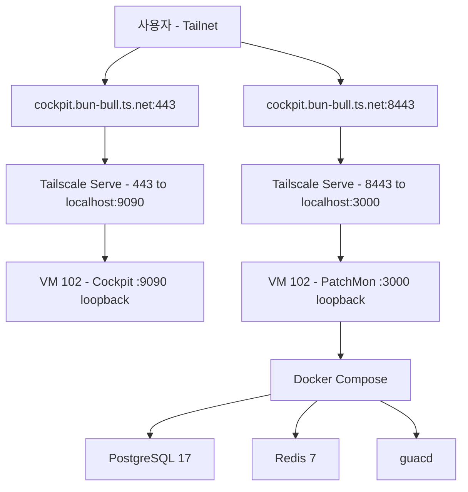

# PatchMon 도입 Design

> **Source**: 본 문서는 homelab IaC 레포의 두 번째 모니터링/관리 도구 도입 design. 회사 서버 적용 전 사전 테스트가 1차 목적. Cockpit(VM 102) 완료 후 후속.
>
> **검증 이력 (2026-07-06):** Antigravity(Gemini 3.1 Pro High) 단일 검증 완료. Codex(gpt-5.5)는 사용량 초과로 미실시 (Jul 22 reset). Blocker 4건, Risk 2건 반영 — Caddy path-based 접근 폐기, Tailscale Serve 8443 독립 노출로 단순화.

## 목차

- [배경 및 목적](#배경-및-목적)
- [아키텍처](#아키텍처)
- [Docker 및 PatchMon 배포](#docker-및-patchmon-배포)
- [Tailscale Serve 다중 포트 노출](#tailscale-serve-다중-포트-노출)
- [Ansible — cockpit role 확장](#ansible--cockpit-role-확장)
- [시크릿 관리](#시크릿-관리)
- [노출 및 인증 전략](#노출-및-인증-전략)
- [회사 서버 적용 시 차이점](#회사-서버-적용-시-차이점)
- [검증 계획](#검증-계획)
- [Out of Scope](#out-of-scope)
- [검증 이력](#검증-이력)

## 배경 및 목적

- **1차 목적:** 회사 서버 패치 모니터링 도구 도입 전, homelab에서 사전 검증
- **재현성:** 동일 Ansible playbook을 회사 Ubuntu 서버에 그대로 적용 가능해야 함
- **범위:** PatchMon만 단독 진행 (Pulse는 별도 design)
- **의사결정:** Cockpit VM(102)에 통합 배포. Docker Compose로 PatchMon 4컨테이너 실행. **Caddy 없이 Tailscale Serve 다중 포트로 노출** (검증 결과 단순화).

PatchMon 선택 이유: 엔터프라이즈급 패치 모니터링 + Proxmox LXC auto-enrollment + outbound-only agent 모델 (방화벽 친화적). Docker 배포로 회사 Ubuntu 서버 재현성 확보.

### 설계 변경 이력 (검증 반영)

초안은 Caddy path-based 리버스 프록시(`/patchmon` → 3000)를 제안했으나, Antigravity 검증에서 4개 Blocker 발견:

| Blocker | 초안 문제 | 해결 |
|:---|:---|:---|
| B1 | SPA 절대경로(`/api/v1/*`) → `handle_path` prefix strip 시 라우팅 실패 | Caddy 폐기, PatchMon 독립 포트(8443) 노출 |
| B2 | Caddyfile `:8080` → 0.0.0.0 바인딩 (LAN 노출) | Caddy 제거로 해결 |
| B3 | Docker `"3000:3000"` → 0.0.0.0 바인딩 (LAN 노출) | `"127.0.0.1:3000:3000"` loopback 바인딩 |
| B4 | Tailscale Serve HTTPS 허용 포트 제한 (443/8443/10000) | 8443 사용 (허용 포트) |

> Caddy path-based 대신 Tailscale Serve 다중 포트가 KISS/YAGNI에 부합. Caddy 설정/유지보수 부담 제거, SPA 라우팅 리스크 원천 회피.

## 아키텍처



```
VM 102: cockpit (Ubuntu 24.04 LTS, Tailscale 조인)
├── Cockpit (systemd socket, :9090 loopback)              # 기존
├── Docker Engine                                           # 신규
│   └── PatchMon Compose (4 containers)                     # 신규
│       ├── server (ghcr.io/patchmon/patchmon-server, :127.0.0.1:3000)
│       ├── database (postgres:17-alpine, volume)
│       ├── redis (redis:7-alpine, volume)
│       └── guacd (guacamole/guacd, :4822 internal)
├── Tailscale Serve                                        # 확장
│   ├── 443 → https+insecure://localhost:9090 (Cockpit, 기존)
│   └── 8443 → http://localhost:3000 (PatchMon, 신규)
```

**프로비저닝 흐름:**


> OpenTofu 변경 없음 — VM 102은 이미 프로비저닝됨. Ansible만으로 배포 (기존 cockpit role 확장).

**리소스:** VM 102 (4GB RAM, 2 vCPU, 30GB disk). Cockpit ~100MB, Docker overhead ~100MB, PatchMon 4컨테이너 ~1.5-2GB. 여유분 충분.

## Docker 및 PatchMon 배포

### Docker Engine 설치 (`docker.yml`)

- Docker official apt repo 사용 (Ubuntu docker.io 아님)
- 패키지: `docker-ce`, `docker-ce-cli`, `containerd.io`, `docker-compose-plugin`
- `when: cockpit_patchmon_enabled | bool` — 비활성화 시 Docker 설치 스킵
- 설치 후 `docker compose version` 확인 태스크

### PatchMon Compose 배포 (`patchmon.yml`)

- 배포 경로: `/opt/patchmon/`
- `docker-compose.yml`은 Ansible template으로 관리 (PatchMon 공식 compose 기반, 이미지 태그 변수화)
- `.env`는 `patchmon.env.j2` template → 시크릿은 Ansible 변수에서 주입 (sops 경유)
- `.env` 파일 권한: `mode: "0600"`, `owner: root`, `group: root` (R-AGY1 반영)
- `docker compose up -d --wait` (healthcheck 대기 후 완료)
- 볼륨: Docker named volumes (`postgres_data`, `redis_data`) — VM 재시작 후 데이터 유지

### docker-compose.yml (Ansible template)

> **B3 반영:** server 포트 매핑을 `"127.0.0.1:3000:3000"`로 loopback 제한 (LAN 노출 차단).

```yaml
name: patchmon

services:
  server:
    image: ghcr.io/patchmon/patchmon-server:{{ cockpit_patchmon_version }}
    restart: unless-stopped
    env_file: .env
    ports:
      - "127.0.0.1:3000:3000"    # B3: loopback only (LAN 노출 차단)
    networks:
      - patchmon-internal
    depends_on:
      database:
        condition: service_healthy
      redis:
        condition: service_healthy
      guacd:
        condition: service_healthy
    logging:
      driver: "json-file"
      options:
        max-size: "10m"
        max-file: "3"

  database:
    image: postgres:17-alpine
    restart: unless-stopped
    env_file: .env
    volumes:
      - postgres_data:/var/lib/postgresql/data
    networks:
      - patchmon-internal
    healthcheck:
      test: ["CMD-SHELL", "pg_isready -U ${POSTGRES_USER} -d ${POSTGRES_DB}"]
      interval: 3s
      timeout: 5s
      retries: 7
    logging:
      driver: "json-file"
      options:
        max-size: "10m"
        max-file: "3"

  redis:
    image: redis:7-alpine
    restart: unless-stopped
    env_file: .env
    command: redis-server --requirepass ${REDIS_PASSWORD}
    volumes:
      - redis_data:/data
    networks:
      - patchmon-internal
    healthcheck:
      test: ["CMD", "redis-cli", "--no-auth-warning", "-a", "${REDIS_PASSWORD}", "ping"]
      interval: 3s
      timeout: 5s
      retries: 7
    logging:
      driver: "json-file"
      options:
        max-size: "10m"
        max-file: "3"

  guacd:
    image: guacamole/guacd:latest
    restart: unless-stopped
    read_only: true
    tmpfs:
      - /tmp:size=64m
    security_opt:
      - no-new-privileges:true
    cap_drop:
      - ALL
    mem_limit: 512m
    cpus: '1.0'
    networks:
      - patchmon-internal
    healthcheck:
      test: ["CMD-SHELL", "nc -z localhost 4822 || exit 1"]
      interval: 10s
      timeout: 5s
      retries: 3
      start_period: 10s
    logging:
      driver: "json-file"
      options:
        max-size: "10m"
        max-file: "3"

volumes:
  postgres_data:
  redis_data:

networks:
  patchmon-internal:
    driver: bridge
```

### patchmon.env.j2 (핵심 변수만, 전체는 env.example 참조)

```env
# CORS_ORIGIN — Tailscale 도메인 (CORS용)
CORS_ORIGIN={{ cockpit_patchmon_cors_origin }}

# Database
POSTGRES_HOST=database
POSTGRES_PASSWORD={{ patchmon_postgres_password }}
POSTGRES_USER=patchmon_user
POSTGRES_DB=patchmon_db
DATABASE_URL=postgresql://patchmon_user:{{ patchmon_postgres_password }}@database:5432/patchmon_db

# Redis
REDIS_HOST=redis
REDIS_PORT=6379
REDIS_PASSWORD={{ patchmon_redis_password }}

# Secrets
JWT_SECRET={{ patchmon_jwt_secret }}
SESSION_SECRET={{ patchmon_session_secret }}
AI_ENCRYPTION_KEY={{ patchmon_ai_encryption_key }}

# Guacamole (RDP)
GUACD_ADDRESS=guacd:4822
```

> `TRUST_PROXY`는 Tailscale Serve 종단에서 불필요 (직접 HTTP 백엔드). 회사 서버에서 reverse proxy 경유 시 `true`.

## Tailscale Serve 다중 포트 노출

### 구성

VM 102의 Tailscale Serve에 두 개의 HTTPS 백엔드 매핑:

| 포트 | 백엔드 | 용도 |
|:---|:---|:---|
| 443 | `https+insecure://localhost:9090` | Cockpit (기존, 변경 없음) |
| 8443 | `http://localhost:3000` | PatchMon (신규) |

> 8443은 Tailscale Serve가 HTTPS 종단으로 허용하는 포트 (443/8443/10000 중 하나, B4 반영).

### tailscale_serve.yml 수정 (R-AGY2 반영)

R-AGY2: `tailscale serve status` 텍스트 파싱 대신 `--json` + `from_json` 사용 (idempotency 강화).

```yaml
# Tailscale Serve 상태를 JSON으로 취득 (R-AGY2)
- name: Tailscale Serve 상태 확인 (JSON)
  ansible.builtin.command: tailscale serve status --json
  register: ts_serve_status
  changed_when: false

# 현재 8443 매핑 확인
- name: 현재 PatchMon Serve 매핑 확인
  ansible.builtin.set_fact:
    patchmon_serve_current: >-
      {{
        (ts_serve_status.stdout | from_json).Web["8443"].https[0].proxy
        | default('')
      }}
  when: cockpit_patchmon_enabled | bool

# 8443 매핑 추가 (변경 시만)
- name: Tailscale Serve 8443 추가 (PatchMon)
  ansible.builtin.command:
    cmd: tailscale serve --bg --https=8443 --set-path / http://localhost:3000
  when:
    - cockpit_patchmon_enabled | bool
    - patchmon_serve_current != 'http://localhost:3000'
  changed_when: true
```

> 기존 443→Cockpit 매핑은 변경 없음 (별도 태스크에서 기존 패턴 유지). `reset` 전체 초기화 대신 개별 매핑 추가/변경으로 idempotency 보장.

### UFW (방화벽)

- 8443: `tailscale0` 인터페이스만 허용 (기존 443 패턴과 동일)
- 3000: 외부 노출 금지 (Docker loopback 바인딩 + UFW deny)

## Ansible — cockpit role 확장

### 확장된 role 구조

```
roles/cockpit/
├── tasks/
│   ├── main.yml              # 수정: Docker/Patchmon import 추가
│   ├── auth.yml              # 기존: 관리자 계정
│   ├── tailscale_join.yml    # 기존: Tailscale 조인
│   ├── tailscale_serve.yml   # 확장: 8443→PatchMon 매핑 추가
│   ├── docker.yml            # 신규: Docker Engine 설치
│   └── patchmon.yml          # 신규: PatchMon Compose 배포
├── defaults/main.yml         # 확장: PatchMon 변수
├── handlers/main.yml         # 기존 유지 (Caddy handler 불필요)
└── templates/
    ├── cockpit-socket-override.conf.j2  # 기존
    ├── docker-compose.yml.j2            # 신규
    └── patchmon.env.j2                  # 신규
```

### main.yml 수정 (태스크 실행 순서)

| 순서 | 태스크 | 조건 |
|:---|:---|:---|
| 1 | 패키지 + socket + UFW | 항상 |
| 2 | auth | 항상 |
| 3 | tailscale_join | `cockpit_tailscale_serve` |
| 4 | docker.yml | `cockpit_patchmon_enabled` |
| 5 | patchmon.yml | `cockpit_patchmon_enabled` |
| 6 | tailscale_serve.yml | `cockpit_tailscale_serve` (8443 매핑은 `cockpit_patchmon_enabled` 조건부) |

> Docker → PatchMon 순서 보장 (의존성). tailscale_serve.yml은 마지막 (PatchMon 컨테이너 기동 후 매핑).

### defaults/main.yml 확장

```yaml
# === 기존 변수 ===
cockpit_listen_port: 9090
cockpit_bind_loopback_only: true
cockpit_admin_user: cockpit-admin
cockpit_tailscale_serve: true       # homelab: true, 회사 서버: false
cockpit_reverse_proxy: false        # 회사 서버 기존 reverse proxy 사용 시 true
cockpit_manage_firewall: true       # 회사 서버 기존 방화벽 존중 시 false

# === PatchMon (신규) ===
cockpit_patchmon_enabled: true       # false면 Docker/Patchmon 전체 스킵
cockpit_patchmon_dir: /opt/patchmon
cockpit_patchmon_version: latest    # 회사 서버에서는 버전 핀 권장
cockpit_patchmon_cors_origin: "https://cockpit.bun-bull.ts.net:8443"
cockpit_patchmon_serve_port: 8443   # Tailscale Serve HTTPS 포트
```

## 시크릿 관리

### `proxmox/ansible/secrets.sops.yaml` 추가 키

```yaml
# === 기존 (Cockpit) ===
cockpit_admin_password: "<hash>"

# === 신규 (PatchMon) ===
patchmon_postgres_password: "<openssl rand -hex 32>"
patchmon_redis_password: "<openssl rand -hex 32>"
patchmon_jwt_secret: "<openssl rand -hex 64>"
patchmon_session_secret: "<openssl rand -hex 64>"
patchmon_ai_encryption_key: "<openssl rand -hex 64>"
```

- `AI_ENCRYPTION_KEY`는 AI 어시스턴트 기능용. 미사용해도 필수값 (빈 값 불가)
- 기존 Cockpit 시크릿 패턴과 동일: playbook pre_tasks에서 `sops -d` → `from_yaml` → `set_fact`
- `no_log: true` 적용으로 평문 로깅 차단 (Cockpit `29d77b3` fix 패턴)
- `.env` 파일 권한 `0600` / `root:root` (R-AGY1)

## 노출 및 인증 전략

### 노출

- **Cockpit:** `https://cockpit.bun-bull.ts.net/` (Tailscale Serve 443 → Cockpit 9090, 기존 유지)
- **PatchMon:** `https://cockpit.bun-bull.ts.net:8443/` (Tailscale Serve 8443 → PatchMon 3000)
- **TLS:** Tailscale이 종료 (443, 8443 모두)
- **3000 외부 노출:** 금지 (Docker `127.0.0.1:3000` 바인딩 + UFW deny)
- **LAN 노출:** 금지 (모든 서비스 loopback only)

### 인증

- PatchMon 자체 인증: 첫 접속 시 admin 계정 설정 (PatchMon UI 내)
- JWT + httpOnly cookie (PatchMon 기본)
- Cockpit PAM 인증 (기존, 변경 없음)

## 회사 서버 적용 시 차이점

| 항목 | homelab | 회사 서버 |
|:---|:---|:---|
| VM 프로비저닝 | 이미 존재 (VM 102) | 기존 Ubuntu 서버 |
| Docker 설치 | Ansible | **동일 Ansible** |
| PatchMon 배포 | Ansible | **동일 Ansible** |
| Tailscale Serve | 443(Cockpit) + 8443(PatchMon) | `false` (기존 reverse proxy 경유) |
| PatchMon 이미지 태그 | `latest` | 버전 핀 권장 |
| CORS_ORIGIN | `cockpit.bun-bull.ts.net:8443` | 회사 도메인 |
| 방화벽 | UFW (Ansible 관리) | `cockpit_manage_firewall: false` |
| `TRUST_PROXY` | 불필요 (직접 HTTP) | `true` (reverse proxy 경유 시) |

> 변수화: `cockpit_patchmon_enabled`, `cockpit_tailscale_serve`, `cockpit_manage_firewall`, `cockpit_reverse_proxy`, `cockpit_patchmon_version`, `cockpit_patchmon_cors_origin`, `cockpit_patchmon_serve_port` — 7개 변수로 homelab/회사 환경 명시적 제어.

## 검증 계획

### Docker

1. `docker --version` → verify: Docker CE 설치됨
2. `docker compose version` → verify: compose plugin v2 설치됨
3. `ss -tlnp | grep 3000` → verify: `127.0.0.1:3000`만 리스닝 (0.0.0.0 아님, B3)

### PatchMon

1. `docker compose -f /opt/patchmon/docker-compose.yml ps` → verify: 4컨테이너 모두 healthy
2. `curl -s -o /dev/null -w "%{http_code}" http://localhost:3000` → verify: 200 (loopback)
3. `curl -s -o /dev/null -w "%{http_code}" http://<VM_LAN_IP>:3000` → verify: 연결 거부 (B3, LAN 차단)
4. PatchMon 첫 관리자 설정 → verify: admin 계정 생성, 대시보드 정상

### Tailscale Serve

1. `tailscale serve status` → verify: 443→Cockpit, 8443→PatchMon 두 매핑 존재
2. `https://cockpit.bun-bull.ts.net/` → verify: Cockpit 로그인 페이지 (기존 유지, regression 없음)
3. `https://cockpit.bun-bull.ts.net:8443/` → verify: PatchMon 페이지
4. 2차 실행 → verify: changed 0 (idempotency, `--json` 기반)

### Ansible Idempotency

1. `ansible-playbook playbooks/cockpit.yml --check` → verify: dry-run 성공
2. 1차 실제 적용 → verify: changed count 확인
3. 2차 실행 → verify: changed 0

### End-to-End

1. Cockpit 접속 → verify: 기존 기능 정상 (regression 없음)
2. PatchMon 접속 → verify: 대시보드, 호스트 인벤토리 정상
3. PatchMon 에이전트 등록 테스트 (선택) → verify: 호스트 패키지 정보 수집

## Out of Scope

- Pulse 도입 (별도 design)
- PatchMon agent 자동 배포 (heritage LXC, cockpit VM 등 — 사후 검증 완료 후 별도 진행)
- Proxmox LXC auto-enrollment (agent 배포 시 검토)
- PatchMon OIDC SSO 설정 (회사 Authentik/Keycloak 연동)
- PatchMon AI 어시스턴트 기능 (OpenRouter/Anthropic API 키 필요)
- PatchMon Compliance 스캐닝 (OpenSCAP)
- VM 리소스 확장 (4GB/2vCPU/30GB로 충분)
- 회사 서버 실제 적용 (homelab 검증 완료 후 별도 진행)

## 검증 이력

### 2026-07-06 — Antigravity(Gemini 3.1 Pro High) 단일 검증

> Codex(gpt-5.5)는 사용량 초과로 미실시 (Jul 22 reset). 규칙에 따라 Antigravity 단일 폴백.

**Blocker 4건 (반영 완료):**

| # | 내용 | 반영 |
|:---|:---|:---|
| B1 | SPA 절대경로(`/assets/*`, `/api/v1/*`) → Caddy `handle_path` prefix strip 시 라우팅 실패 | Caddy 폐기, Tailscale Serve 8443 독립 노출로 PatchMon root 배치 |
| B2 | Caddyfile `:8080` → 0.0.0.0 바인딩 (LAN 노출) | Caddy 제거로 해결 |
| B3 | Docker `"3000:3000"` → 0.0.0.0 바인딩 (LAN 노출) | `"127.0.0.1:3000:3000"` loopback 바인딩 |
| B4 | Tailscale Serve HTTPS 허용 포트 443/8443/10000만 → fallback `--https=3000` 불가 | 8443 사용 (허용 포트) |

**Risk 2건 (반영 완료):**

| # | 내용 | 반영 |
|:---|:---|:---|
| R-AGY1 | `.env` template 평문 시크릿 디스크写入 → 권한 미설정 | `mode: "0600"`, `owner: root`, `group: root"` 명시 |
| R-AGY2 | `tailscale serve status` 텍스트 파싱 fragility | `--json` + `from_json` filter 사용 |

**Assumption 검증:** Antigravity는 PatchMon SPA의 `X-Forwarded-Prefix` 서브패스 지원을 미확인으로 지적 → Caddy 접근 폐기로 위험 원천 제거.

**Test 제안 (검증 계획에 반영):**
- LAN에서 `http://<VM_LAN_IP>:3000` 접근 시 연결 거부 확인 (B3)
- PatchMon UI 네비게이션 시 모든 API/asset 요청 200 확인 (B1 회피 확인)
