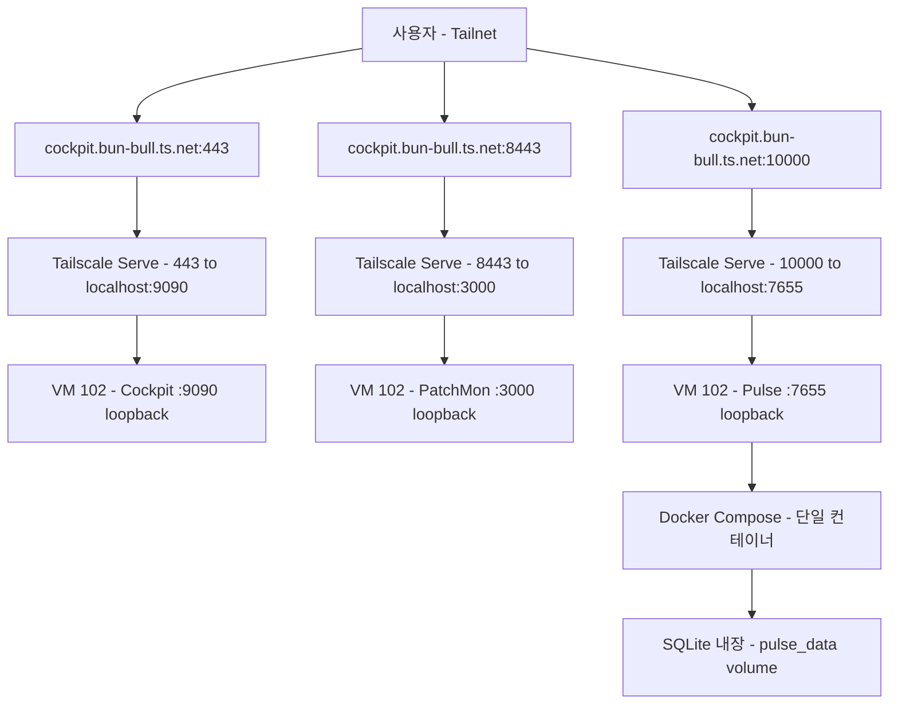
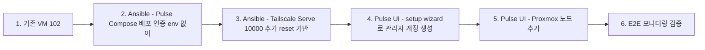

# Pulse 도입 Design

> **Source**: 본 문서는 homelab IaC 레포의 세 번째 모니터링 도구 도입 design. Cockpit(VM 102), PatchMon(VM 102) 완료 후 후속.
>
> **검증 이력 (2026-07-06):** Antigravity(Gemini 3.1 Pro High) + Codex(gpt-5.5) 2-way 교차검증 완료. Blocker 1건, Risk 7건 반영 — Pulse auth env preseed 폐기(UI setup wizard 전환), Tailscale Serve reset 4상태 패턴, healthcheck `/api/health` 전환.

## 목차

- [배경 및 목적](#배경-및-목적)
- [아키텍처](#아키텍처)
- [Docker 및 Pulse 배포](#docker-및-pulse-배포)
- [Tailscale Serve 다중 포트 노출](#tailscale-serve-다중-포트-노출)
- [Ansible — cockpit role 확장](#ansible--cockpit-role-확장)
- [인증 전략 (배포 후 UI 설정)](#인증-전략-배포-후-ui-설정)
- [Proxmox API 연동 (배포 후)](#proxmox-api-연동-배포-후)
- [노출 전략](#노출-전략)
- [회사 서버 적용 시 차이점](#회사-서버-적용-시-차이점)
- [검증 계획](#검증-계획)
- [Out of Scope](#out-of-scope)
- [검증 이력](#검증-이력)

## 배경 및 목적

- **1차 목적:** 회사 서버 인프라 통합 모니터링 도구 도입 전, homelab에서 사전 검증
- **재현성:** 동일 Ansible playbook을 회사 Ubuntu 서버에 그대로 적용 가능해야 함
- **범위:** Pulse만 단독 진행. Cockpit, PatchMon은 완료됨.
- **의사결정:** Cockpit VM(102)에 통합 배포. Docker Compose로 Pulse 단일 컨테이너 실행. Tailscale Serve 10000번 포트로 노출. **인증은 Pulse UI setup wizard로 초기화** (env preseed 폐기, B1 반영).

Pulse 선택 이유: Proxmox VE + Docker + K8s 통합 모니터링 대시보드. 단일 Go 바이너리/Alpine 컨테이너로 배포 간편, SQLite 내장(외부 DB 불필요), AES-256-GCM 암호화로 시크릿 관리 내장. Cockpit(단일 호스트 관리), PatchMon(패치 모니터링)과互补 — Pulse는 **인프라 건강도 통합 모니터링 + 알림** 담당.

### 핵심 결정 사항 (brainstorming + 검증 반영)

| 결정 | 선택 | 근거 |
|:---|:---|:---|
| 배포 대상 | VM 102 통합 | 기존 Docker Engine 재사용, 신규 VM 불필요 (KISS) |
| 모니터링 범위 | API-only + 서버만 | pulse-agent 미배포, Proxmox API로 충분 (YAGNI) |
| Compose 전략 | 독립 Compose (`/opt/pulse/`) | PatchMon과 lifecycle 분리, 영향 격리 |
| Tailscale Serve 포트 | 10000 | 443/8443 다음 허용 포트 |
| **인증 초기화** | **UI setup wizard** (env preseed 폐기) | **B1: Pulse env vars가 UI 설정을 override, env_file 평문 잔류 방지** |

## 아키텍처



```
VM 102: cockpit (Ubuntu 24.04 LTS, Tailscale 조인)
├── Cockpit (systemd socket, :9090 loopback)              # 기존
├── Docker Engine                                           # 기존 (PatchMon용)
│   ├── /opt/patchmon/ — PatchMon Compose (4컨테이너)      # 기존
│   └── /opt/pulse/    — Pulse Compose (1컨테이너)          # 신규
│       └── pulse (rcourtman/pulse:latest, :127.0.0.1:7655)
│           └── pulse_data volume (SQLite, 설정, 암호화 키)
├── Tailscale Serve                                        # 확장 (reset 기반 4상태)
│   ├── 443   → https+insecure://localhost:9090  (Cockpit)
│   ├── 8443  → http://localhost:3000          (PatchMon)
│   └── 10000 → http://localhost:7655          (Pulse)
```

**프로비저닝 흐름:**



> OpenTofu 변경 없음 — VM 102는 이미 프로비저닝됨. Ansible만으로 배포 (기존 cockpit role 확장). 인증 및 Proxmox 노드 추가는 Pulse UI에서 배포 후 수행.

**리소스:** VM 102 (4GB RAM, 2 vCPU, 30GB disk). Cockpit ~100MB, PatchMon 4컨테이너 ~1.5-2GB, Pulse 단일 컨테이너 ~100-200MB. 여유분 충분.

## Docker 및 Pulse 배포

### Pulse Compose 배포 (`pulse.yml`)

- 배포 경로: `/opt/pulse/`
- `docker-compose.yml`은 Ansible template으로 관리 (Pulse 공식 docker run 기반)
- **`.env` 파일 생성하지 않음** (B1 반영) — Pulse 컨테이너에 env_file 전달 안 함. 인증은 UI setup wizard로 초기화.
- `docker compose up -d --wait` (healthcheck 대기 후 완료)
- 볼륨: Docker named volume (`pulse_data`) — SQLite DB, 설정, 암호화 키 영구 보존

> Docker Engine은 PatchMon 배포 시 이미 설치됨. `cockpit_pulse_enabled`가 true이고 Docker가 없는 경우(회사 서버 등)에만 docker.yml이 설치 담당 (기존 조건부 로직 재사용).

### docker-compose.yml (Ansible template)

> R3 반영: healthcheck를 `nc -z`에서 공식 `/api/health` 엔드포인트 기반으로 변경. R2 반영: `mem_limit` 추가. R6 반영: 포트 변수화.

```yaml
name: pulse

services:
  pulse:
    image: rcourtman/pulse:{{ cockpit_pulse_version }}
    restart: unless-stopped
    ports:
      - "127.0.0.1:{{ cockpit_pulse_internal_port }}:{{ cockpit_pulse_internal_port }}"  # R6: 변수화, loopback only
    volumes:
      - pulse_data:/data         # R3(Antigravity): 영구 데이터 (SQLite, 설정, 암호화 키)
    mem_limit: 512m              # R2(Antigravity): OOM 방지
    cpus: '1.0'
    security_opt:
      - no-new-privileges:true
    environment:
      # B1(Codex): 인증 env vars 사용 안 함 — UI setup wizard로 초기화
      # env vars가 UI 설정을 override하므로 PULSE_AUTH_USER/PASS를 넣으면
      # /data/.env 미생성 + docker inspect에 평문 잔류
      FRONTEND_PORT: "{{ cockpit_pulse_internal_port }}"
      PULSE_METRICS_PORT: "9091"
      PULSE_METRICS_BIND_ADDRESS: "127.0.0.1"
      # R4(Codex): PULSE_TELEMETRY 제거 — 공식 문서 미확인, no-op 가능성
    healthcheck:
      test: ["CMD-SHELL", "wget -q --spider http://localhost:{{ cockpit_pulse_internal_port }}/api/health || exit 1"]  # R3(Codex): /api/health 기반
      interval: 30s
      timeout: 5s
      retries: 3
      start_period: 30s         # 초기화 여유 (setup wizard 준비)
    logging:
      driver: "json-file"
      options:
        max-size: "10m"
        max-file: "3"

volumes:
  pulse_data:
```

> 환경변수는 `environment` 블록에 평문이 아닌 **민감하지 않은 설정값만** (포트, metrics 바인딩). 인증 관련 env는 어떤 것도 전달하지 않음. HTTPS 관련 변수도 미설정 — Tailscale Serve가 TLS 종단.

## Tailscale Serve 다중 포트 노출

### 구성

VM 102의 Tailscale Serve에 세 개의 HTTPS 백엔드 매핑:

| 포트 | 백엔드 | 스킴 | 용도 |
|:---|:---|:---|:---|
| 443 | `localhost:9090` | `https+insecure` | Cockpit (자가서명 TLS, 기존) |
| 8443 | `localhost:3000` | `http` | PatchMon (기존) |
| 10000 | `localhost:7655` | `http` | Pulse (신규) |

> 10000은 Tailscale Serve HTTPS 허용 포트 (443/8443/10000). Tailnet 내부 노출이므로 LAN에 노출되지 않음.

### tailscale_serve.yml 수정 — reset 기반 4상태 패턴 (R1, R2 반영)

> **R1(Codex):** 기존 role은 `tailscale serve reset` + 전체 재구성 패턴. add-only로 확장하면 `cockpit_pulse_enabled=false` 전환 시 10000 stale 매핑이 남음. reset 패턴을 유지하면 활성화된 서비스만 재구성되어 stale 자동 제거.
>
> **R2(Codex):** `9f9bb7e` fix의 `failed_when: false` + 빈 stdout 기본값 패턴 유지 (기존 구현에 이미 반영됨, spec에 명시).

Pulse 추가로 **4상태** 관리 필요:

| 상태 | Cockpit(443) | PatchMon(8443) | Pulse(10000) | 조건 |
|:---|:---|:---|:---|:---|
| 1 | ✅ | — | — | PatchMon off, Pulse off |
| 2 | ✅ | ✅ | — | PatchMon on, Pulse off |
| 3 | ✅ | — | ✅ | PatchMon off, Pulse on |
| 4 | ✅ | ✅ | ✅ | PatchMon on, Pulse on |

기존 2상태 로직(상태 1, 2)을 4상태로 확장. 각 상태별 `serve_needs_reconfig` 판정 + reset 기반 재구성.

```yaml
# === 기존 유지 (9f9bb7e fix 패턴, R2 반영) ===
- name: Tailscale Serve 상태 확인 (JSON)
  ansible.builtin.command: tailscale serve status --json
  register: ts_serve_status
  changed_when: false
  failed_when: false              # R2: 실패 가드

- name: 현재 Serve 매핑 파싱
  ansible.builtin.set_fact:
    ts_current_serve: "{{ ts_serve_status.stdout | from_json }}"
  when: ts_serve_status.stdout | length > 0

- name: ts_current_serve 기본값 (빈 stdout 대비, R2)
  ansible.builtin.set_fact:
    ts_current_serve: {}
  when: ts_serve_status.stdout | length == 0

# === Pulse 확장 (R1: reset 기반 4상태) ===
# 상태별 필요한 TCP 포트 집합 계산
- name: 필요 Serve 포트 집합 계산
  ansible.builtin.set_fact:
    serve_required_ports: >-
      {{
        ['443']
        | union((cockpit_patchmon_enabled | bool) | ternary(['8443'], []))
        | union((cockpit_pulse_enabled | bool) | ternary(['10000'], []))
      }}

# 현재 TCP 포트와 필요 포트 비교 → 재구성 필요 여부
- name: Serve 재구성 필요 여부 판정
  ansible.builtin.set_fact:
    serve_needs_reconfig: >-
      {{
        ts_current_serve.TCP is not defined
        or (serve_required_ports | difference(ts_current_serve.TCP.keys())) | length > 0
        or (ts_current_serve.TCP.keys() | difference(serve_required_ports)) | length > 0
      }}

# reset 후 활성화된 서비스만 재구성 (stale 매핑 자동 제거)
- name: Tailscale Serve 재구성
  ansible.builtin.shell: |
    tailscale serve reset
    tailscale serve --bg --https=443 --set-path / https+insecure://localhost:{{ cockpit_listen_port }}
    
    tailscale serve --bg --https={{ cockpit_patchmon_serve_port }} --set-path / http://localhost:3000
    
    
    tailscale serve --bg --https={{ cockpit_pulse_serve_port }} --set-path / http://localhost:{{ cockpit_pulse_internal_port }}
    
  when:
    - serve_needs_reconfig | bool
    - cockpit_tailscale_serve | bool
  changed_when: true
```

> 기존 2상태 분기(상태 1/2별 별도 task)를 단일 동적 로직으로 통합 — 포트 집합 차이로 재구성 판정, Jinja2 조건부로 활성 서비스만 구성. 4상태 모두를 개별 task로 작성하면 중복이 심하므로 동적 패턴 채택.

### UFW (방화벽)

`main.yml`에 10000 허용 규칙 추가 (기존 443/8443 패턴):

```yaml
- name: UFW — Tailscale 인터페이스만 10000 허용 (Pulse Serve)
  community.general.ufw:
    rule: allow
    direction: in
    port: "{{ cockpit_pulse_serve_port }}"
    proto: tcp
    interface: tailscale0
  when:
    - cockpit_manage_firewall | bool
    - cockpit_tailscale_serve | bool
    - cockpit_pulse_enabled | bool
```

## Ansible — cockpit role 확장

### 확장된 role 구조

```
roles/cockpit/
├── tasks/
│   ├── main.yml              # 수정: Pulse import + UFW 10000 추가
│   ├── auth.yml              # 기존: 관리자 계정
│   ├── tailscale_join.yml    # 기존: Tailscale 조인
│   ├── tailscale_serve.yml   # 확장: reset 기반 4상태 (Pulse 10000 추가)
│   ├── docker.yml            # 기존: Docker Engine 설치
│   ├── patchmon.yml          # 기존: PatchMon Compose 배포
│   └── pulse.yml             # 신규: Pulse Compose 배포 (env_file 없음)
├── defaults/main.yml         # 확장: Pulse 변수
├── handlers/main.yml         # 기존 유지
└── templates/
    ├── cockpit-socket-override.conf.j2  # 기존
    ├── docker-compose.yml.j2            # 기존 (PatchMon)
    ├── patchmon.env.j2                  # 기존
    └── pulse-docker-compose.yml.j2      # 신규 (env_file 없음, environment 블록만)
```

> PatchMon과 달리 **pulse.env.j2 템플릿 불필요** (B1: env_file 생성 안 함). `environment` 블록은 compose 템플릿 내에 직접 작성.

### main.yml 수정 (태스크 실행 순서)

| 순서 | 태스크 | 조건 |
|:---|:---|:---|
| 1 | 패키지 + socket + UFW (443/8443/10000) | 10000은 `cockpit_pulse_enabled` 조건부 |
| 2 | auth | 항상 |
| 3 | tailscale_join | `cockpit_tailscale_serve` |
| 4 | docker.yml | `cockpit_patchmon_enabled` 또는 `cockpit_pulse_enabled` |
| 5 | patchmon.yml | `cockpit_patchmon_enabled` |
| 6 | pulse.yml | `cockpit_pulse_enabled` |
| 7 | tailscale_serve.yml | `cockpit_tailscale_serve` (10000 매핑은 `cockpit_pulse_enabled` 조건부) |

> docker.yml 조건 확장: PatchMon 또는 Pulse 중 하나라도 활성화되면 Docker 설치.

### defaults/main.yml 확장

```yaml
# === 기존 변수 ===
cockpit_listen_port: 9090
cockpit_bind_loopback_only: true
cockpit_admin_user: cockpit-admin
cockpit_tailscale_serve: true
cockpit_reverse_proxy: false
cockpit_manage_firewall: true

# === PatchMon (기존) ===
cockpit_patchmon_enabled: true
cockpit_patchmon_dir: /opt/patchmon
cockpit_patchmon_version: latest
cockpit_patchmon_cors_origin: "https://cockpit.bun-bull.ts.net:8443"
cockpit_patchmon_serve_port: 8443

# === Pulse (신규) ===
cockpit_pulse_enabled: true        # false면 Pulse 전체 스킵
cockpit_pulse_dir: /opt/pulse
cockpit_pulse_version: latest     # 회사 서버에서는 버전 핀 권장
cockpit_pulse_internal_port: 7655  # Pulse 컨테이너 내부 포트
cockpit_pulse_serve_port: 10000   # Tailscale Serve HTTPS 포트
```

## 인증 전략 (배포 후 UI 설정)

### B1(Codex) 반영: env preseed 폐기

Codex가 Pulse 공식 문서(Docker Hub, INSTALL/CONFIGURATION) 확인 결과:

- **Pulse Docker env vars는 UI 설정을 override함** — `PULSE_AUTH_USER`/`PULSE_AUTH_PASS`를 env로 넘기면 UI 설정 무시
- **env 기반 설정 시 `/data/.env`가 생성되지 않음** — Pulse가 자체 암호화 저장소를 초기화하지 않음
- 즉 Ansible `env_file`에 평문 비밀번호를 넣으면 `/opt/pulse/.env` 파일 + `docker inspect` 출력에 **평문이 영구 잔류**

### 해결: UI setup wizard로 초기화

Pulse는 첫 접속 시 setup wizard로 관리자 계정을 생성하도록 설계됨. Ansible은 **컨테이너 배포까지만** 담당:

1. Ansible: Pulse 컨테이너 배포 (env_file 없이, `environment` 블록에 포트/metrics 설정만)
2. 사용자: `https://cockpit.bun-bull.ts.net:10000/` 접속 → setup wizard로 관리자 계정 생성
3. Pulse: 비밀번호를 bcrypt(cost 12) 해싱하여 `/data/.env`에 저장 (AES-256-GCM 암호화 저장소 내)
4. 이후 모든 시크릿(Proxmox API 토큰, 알림 webhook 등)은 Pulse UI에서 설정 시 자체 암호화

> PatchMon과 동일 패턴 — "첫 접속 시 admin 계정 설정 (UI 내)". sops 키 불필요. IaC는 인프라 배포만, 애플리케이션 설정은 UI에서.

### sops 변경 사항

**Pulse 관련 sops 키 추가 없음** — `pulse_auth_user`/`pulse_auth_pass` 모두 제거. 기존 Cockpit/PatchMon sops 키는 변경 없음.

## Proxmox API 연동 (배포 후)

Pulse 배포 후 UI에서 walle을 Proxmox 노드로 수동 추가.

### R1(Antigravity) 반영: API 토큰 권한 최소화

| 항목 | 값 |
|:---|:---|
| Token 형식 | `pulse@pam!pulse-monitoring=<secret>` (또는 전용 사용자) |
| Role | **`PVEAuditor`** (읽기 전용) — `Administrator` 금지 |
| 대상 | walle 노드 전체 (`/`) |

### R7(Codex) 반영: SSL 전략 단일화

Proxmox API 연결을 **Tailscale 도메인 사용**으로 고정:

| 연결 방식 | URL | TLS 검증 | 채택 |
|:---|:---|:---|:---|
| Tailscale 도메인 | `https://walle.bun-bull.ts.net:443` (Serve 경유 → 8006) | 유효한 TLS (Tailscale 발급) | **✅ 채택** |
| LAN 직접 | `https://<walle_LAN_IP>:8006` | 자가서명 → skip 필요 | ❌ |

> Tailscale 도메인 사용 시 Pulse UI에서 **TLS skip 불필요** — Tailscale이 유효한 Let's Encrypt 인증서 제공. SSL 전략이 혼재하지 않도록 단일 경로 고정.

## 노출 전략

- **Cockpit:** `https://cockpit.bun-bull.ts.net/` (Tailscale Serve 443, 기존 유지)
- **PatchMon:** `https://cockpit.bun-bull.ts.net:8443/` (Tailscale Serve 8443, 기존 유지)
- **Pulse:** `https://cockpit.bun-bull.ts.net:10000/` (Tailscale Serve 10000 → Pulse 7655)
- **TLS:** Tailscale이 종단 (443, 8443, 10000 모두)
- **7655 외부 노출:** 금지 (Docker `127.0.0.1:7655` 바인딩 + UFW deny)
- **LAN 노출:** 금지 (모든 서비스 loopback only)

## 회사 서버 적용 시 차이점

| 항목 | homelab | 회사 서버 |
|:---|:---|:---|
| VM 프로비저닝 | 이미 존재 (VM 102) | 기존 Ubuntu 서버 |
| Docker 설치 | Ansible (이미 설치됨) | **동일 Ansible** |
| Pulse 배포 | Ansible | **동일 Ansible** |
| Tailscale Serve | 443(Cockpit) + 8443(PatchMon) + 10000(Pulse) | `false` (기존 reverse proxy 경유) |
| Pulse 이미지 태그 | `latest` | 버전 핀 권장 |
| 방화벽 | UFW (Ansible 관리) | `cockpit_manage_firewall: false` |
| Proxmox 노드 추가 | Pulse UI (Tailscale 도메인) | 회사 도메인 |
| **reverse proxy** | Tailscale Serve (직접) | **R5: WebSocket 지원 + `X-Forwarded-Proto: https` 필수** |

### R5(Codex) 반영: 회사 서버 reverse proxy 요구사항

Pulse 공식 REVERSE_PROXY 문서 기준:
- **WebSocket 지원 필수** — Pulse 실시간 업데이트가 WebSocket 사용
- **`X-Forwarded-Proto: https` 헤더 전달** — TLS termination 뒤에서 Pulse가 올바른 프로토콜 인식
- 회사 서버에서 Caddy/Nginx/Traefic 등 사용 시 위两项 설정 필요

> 변수화: `cockpit_pulse_enabled`, `cockpit_pulse_version`, `cockpit_pulse_internal_port`, `cockpit_pulse_serve_port` — PatchMon 7개 변수에 4개 추가로 homelab/회사 환경 명시적 제어.

## 검증 계획

### Docker

1. `docker compose -f /opt/pulse/docker-compose.yml ps` → verify: pulse 컨테이너 healthy
2. `docker compose config` → verify: env/port/volume 최종 렌더링에 평문 시크릿 없음 (B1)
3. `docker inspect $(docker compose -f /opt/pulse/docker-compose.yml ps -q)` → verify: `PULSE_AUTH_PASS` 평문 노출 없음 (B1)
4. `ss -tlnp | grep 7655` → verify: `127.0.0.1:7655`만 리스닝 (0.0.0.0 아님)
5. `docker stats --no-stream` → verify: Pulse 메모리 512MB 이하 (R2)

### Pulse

1. `curl -s -o /dev/null -w "%{http_code}" http://localhost:7655/api/health` → verify: 200 (loopback, R3 healthcheck 엔드포인트)
2. `curl -s -o /dev/null -w "%{http_code}" http://<VM_LAN_IP>:7655` → verify: 연결 거부 (LAN 차단)
3. Pulse setup wizard 접속 → verify: 관리자 계정 생성 정상

### Tailscale Serve

1. `tailscale serve status --json | jq '.TCP["10000"]'` → verify: 10000 매핑 존재 (R1)
2. `https://cockpit.bun-bull.ts.net/` → verify: Cockpit 로그인 페이지 (regression 없음)
3. `https://cockpit.bun-bull.ts.net:8443/` → verify: PatchMon 페이지 (regression 없음)
4. `https://cockpit.bun-bull.ts.net:10000/` → verify: Pulse setup wizard 페이지
5. `cockpit_pulse_enabled=false` 설정 후 재실행 → verify: 10000 매핑 제거됨 (R1 stale 방지)
6. 2차 실행 → verify: changed 0 (idempotency, 포트 집합 비교 기반)

### Proxmox API 연동 (배포 후)

1. `curl -k -H "Authorization: PVEAPIToken=pulse@pam!pulse-monitoring=<TOKEN>" https://walle.bun-bull.ts.net/api2/json/nodes` → verify: 노드 정보 JSON 반환 (R7 Tailscale 도메인)
2. Pulse UI에서 walle 노드 추가 (Tailscale 도메인, TLS skip 없음) → verify: VM/LXC 목록 표시
3. API 토큰 Role 확인 → verify: `PVEAuditor` (읽기 전용, R1)

### Ansible Idempotency

1. `ansible-playbook playbooks/cockpit.yml --check` → verify: dry-run 성공
2. 1차 실제 적용 → verify: changed count 확인
3. 2차 실행 → verify: changed 0

### End-to-End

1. Cockpit 접속 → verify: 기존 기능 정상 (regression 없음)
2. PatchMon 접속 → verify: 기존 기능 정상 (regression 없음)
3. Pulse 접속 → verify: 대시보드 정상, walle 노드 메트릭 표시
4. Pulse 알림 설정 (선택) → verify: Discord/Telegram webhook 정상 동작

## Out of Scope

- pulse-agent 배포 (walle, heritage 등 호스트) — API-only로 충분, 별도 진행
- Pulse AI 기능 (Chat Assistant, Patrol) — BYOK API 키 필요, 별도 설정
- Pulse Pro 기능 (Alert AI 분석, Auto-fix, PDF/CSV 리포트) — 유료
- Pulse 알림 채널 상세 설정 (Discord/Slack/Telegram/Email) — 배포 후 UI에서 설정
- Pulse OIDC/SSO 설정 (회사 Authentik/Keycloak 연동) — 별도 진행
- VM 리소스 확장 (4GB/2vCPU/30GB로 충분)
- 회사 서버 실제 적용 (homelab 검증 완료 후 별도 진행)
- **Ansible 2.25 `apt_repository` deprecation 대응** — Codex 검증에서 경고 2건 발견 (tailscale_join.yml, docker.yml). Pulse Blocker는 아니나 별도 기술 부채 정리 대상

## 검증 이력

### 2026-07-06 — Antigravity(Gemini 3.1 Pro High) + Codex(gpt-5.5) 2-way 교차검증

두 에이전트가 서로의 결과를 보지 않고 독립 검색·검증. Claude가 판사로 취합. Codex는 Pulse 공식 문서(Docker Hub, INSTALL/CONFIGURATION/REVERSE_PROXY)를 직접 확인하여 Antigravity가 놓친 설계 결함 발견.

**Blocker 1건 (Codex 단독 발견, 반영 완료):**

| # | 내용 | 반영 |
|:---|:---|:---|
| B1 | `PULSE_AUTH_PASS` env preseed → Pulse 공식 문서상 env vars가 UI 설정 override, env 기반 시 `/data/.env` 미생성. env_file 평문이 `/opt/pulse/.env` + `docker inspect`에 영구 잔류 | **env preseed 폐기, UI setup wizard로 초기화 전환**. sops에서 `pulse_auth_*` 제거, `.env` 템플릿 삭제, `environment` 블록에 포트/metrics 설정만 |

**Risk 7건 (반영 완료):**

| # | 발견 | 내용 | 반영 |
|:---|:---|:---|:---|
| R1 | Codex | Tailscale Serve add-only → `cockpit_pulse_enabled=false` 시 10000 stale 매핑 잔류 | reset 기반 4상태 패턴으로 통합 (동적 포트 집합 비교) |
| R2 | Codex | `tailscale serve status --json` 실패/빈 stdout guard 누락 | `failed_when: false` + 빈 stdout 기본값 명시 (`9f9bb7e` fix 패턴) |
| R3 | Codex | healthcheck `nc -z`는 port-open만 확인 → 앱 health 과대평가 | `wget --spider http://localhost:7655/api/health`로 변경 (공식 compose 패턴) |
| R4 | Codex | `PULSE_TELEMETRY=false` 공식 문서 미확인, no-op 가능성 | 환경변수 제거 |
| R5 | Codex | 회사 서버 reverse proxy WebSocket/X-Forwarded-Proto 누락 | 회사 서버 차이점에 명시 (WebSocket 필수, `X-Forwarded-Proto: https`) |
| R6 | Codex | `cockpit_pulse_*_port` 변수 선언 vs compose/Serve 예시 hardcode 불일치 | compose `environment`/`ports` 및 Serve 명령어에 변수 사용 |
| R7 | Codex | Proxmox API SSL 전략 혼재 (Tailscale 경유 vs LAN 직접) | Tailscale 도메인 사용으로 고정 (TLS skip 불필요) |

**Antigravity Risk 3건 (Codex 검증 전, 이미 반영됨):**

| # | 내용 | 반영 |
|:---|:---|:---|
| R-AGY1 | Proxmox API 토큰 과도한 권한 | `PVEAuditor` 역할(읽기 전용) 권장 |
| R-AGY2 | Docker 컨테이너 메모리 제한 누락 | `mem_limit: 512m` 추가 |
| R-AGY3 | 볼륨 마운트 누락 | `pulse_data` named volume |

**Antigravity Blocker 1건 (Non-issue):**

| # | 내용 | 판정 |
|:---|:---|:---|
| B-AGY1 | Tailscale MagicDNS/HTTPS 활성화 필요 | **Non-issue** — 기존 443/8443 작동 중으로 이미 활성화 |

**Assumption 검증 (양쪽 합의):**
- `PVEAuditor` 역할 적절 (Pulse 공식 troubleshooting도 언급)
- `/data` named volume 적절 (공식 Docker 예시 동일)
- HTTPS 미설정 적절 (Tailscale Serve/reverse proxy가 TLS 종단, KISS)

**Codex Test 검증 수행:**
- `ansible-playbook playbooks/cockpit.yml --syntax-check` 통과 (locale: `en_US.utf8`, tmp: `/tmp/ansible-local`)
- 경고: `apt_repository` deprecation 2건 (Ansible 2.25 전 별도 정리, Pulse 무관)

**추가 Test 제안 (검증 계획에 반영):**
- `docker inspect`에서 평문 `PULSE_AUTH_PASS` 노출 여부 확인 (B1)
- `cockpit_pulse_enabled=false` 후 10000 매핑 제거 확인 (R1)
- `curl /api/health`로 앱 레벨 healthcheck (R3)
