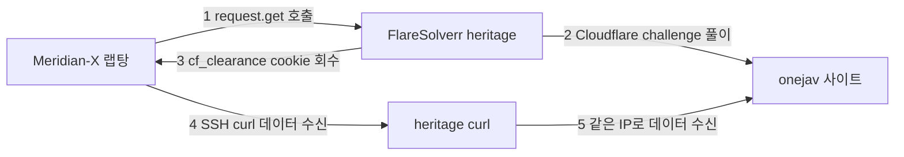

# FlareSolverr on heritage — Design

> **Date**: 2026-07-18
> **Status**: SUPERSEDED / VOID (2026-07-19)
> **Related**: Meridian-X `docs/superpowers/specs/2026-07-18-onejav-flaresolverr-design.md`
>
> **폐기 사유**: 2026-07-19 decisive 테스트로 FlareSolverr heritage 배포 접근이 전면 무효 확인.
> - Cloudflare 게이트는 real Chromium fingerprint로만 통과. FlareSolverr는 RSS/page 가능하나 **`.torrent` 이진 캡처 불가**(브라우저 다운로드로 빠져 본문 미반환) → full chain 불가
> - 채택 방향: Meridian-X 랩탕에서 Playwright 구동 + SSH SOCKS로 heritage egress 터널링. **homelab 인프라 변경 불필요**
> - 따라서 본 homelab FlareSolverr 서비스(compose/Ansible)는 배포하지 않는다.
> - 상세 결정 근거는 Meridian-X spec 상단 "결정적 실측 (Ground Truth)" 섹션 참조.
> - 본 파일은 참조용 잔재. 커밋 전 삭제를 권고하나 삭제 여부는 사용자 판단.

## 목차

- [배경](#배경)
- [목표](#목표)
- [아키텍처](#아키텍처)
- [설계](#설계)
- [검증](#검증)
- [리스크](#리스크)
- [스코프 외 (YAGNI)](#스코프-외-yagni)

## 배경

Meridian-X의 onejav source가 `onejav.com` 접근 시 Cloudflare에 차단된다. 진단 결과(Ground Truth 기반):

- plain curl(OpenSSL TLS fingerprint) → TLS 핸드셰이크 단계에서 RST. sandbox·랩탕·heritage 세 위치 모두 동일
- IP 차단·UA 차단 아님. JS challenge 응답(503 + challenge page)도 관측되지 않음 — 응답 본문 자체가 없음(TLS 단에서 RST)
- 해법: real browser가 challenge를 풀어 `cf_clearance` cookie를 획득 → cookie+UA로 같은 IP에서 데이터 수신

선택한 접근: **FlareSolverr**를 heritage(residential clean IP)에 Docker로 배포. Meridian-X `onejav.py`가 FlareSolverr API로 cookie를 받아, heritage SSH経유 curl로 onejav 데이터를 수신하는 구조. (채택 배경은 Meridian-X spec 참조)

> 비고: TLS fingerprint만 차단이라면 curl-impersonate가 더 가벼운 해법이나, JS challenge 유무를 사전 검증할 수 없어 "어느 쪽이든 동작"하는 FlareSolverr를 선택.

## 목표

- heritage에 FlareSolverr 컨테이너 배포 (Tailnet-only, 인증 없음 고려)
- Meridian-X가 호출 가능한 FlareSolverr API endpoint 제공
- 기존 heritage 서비스(Caddy / Homepage / Transmission / Jellyfin / Aria2) 영향 없음

## 아키텍처



핵심: FlareSolverr는 **heritage IP**에서 challenge를 풀고, cookie도 heritage IP에 묶인다. 따라서 cookie를 재사용하는 데이터 수신 curl도 반드시 heritage(SSH経유)에서 실행 → 기존 onejav.py SSH 구조와 일치.

## 설계

### compose 서비스 추가

`heritage/compose.yml`에 FlareSolverr 서비스 블록을 추가한다. 기존 Ansible deploy 파이프라인(`heritage.yml`: rsync compose → `.env` 복호화 배포 → `docker_compose_v2` up)이 자동 반영하므로 Ansible task 변경은 최소.

```yaml
  # --- Cloudflare bypass (onejav for Meridian-X) ---
  flaresolverr:
    image: ghcr.io/flaresolverr/flaresolverr:latest
    container_name: flaresolverr
    restart: unless-stopped
    environment:
      - LOG_LEVEL=info
      - TZ=Asia/Seoul
    ports:
      - "${HERITAGE_TS_IP}:8191:8191"
    mem_limit: 512m
```

> 이미지 tag는 `latest`로 표기했으나, 재현성을 위해 배포 시점 버전 핀 권장 (`:v3.x.x`).

### 네트워크 / 노출 (보안)

FlareSolverr는 **인증 기능이 없다**. `:8191`에 닿을 수 있는 누구나 headless browser를 원격 이용할 수 있으므로 노출 범위를 엄격히 제한한다.

- `ports: "${HERITAGE_TS_IP}:8191:8191"` — heritage **Tailscale IPv4**에만 bind → Tailnet 장치만 접근 가능
- LAN / 공개 노출 금지. `network_mode: host` 사용 금지 (0.0.0.0 바인딩으로 LAN 노출)
- `HERITAGE_TS_IP`: heritage Tailscale IPv4 (`tailscale ip -4` 값). `heritage/.env`(sops 관리)에 추가

### 배포 (Ansible)

`proxmox/ansible/playbooks/heritage.yml` 변경 최소:

1. `heritage/compose.yml` 서비스 추가 → rsync + `docker_compose_v2`가 자동 반영
2. `HERITAGE_TS_IP`를 `heritage/.env.sops`에 추가 (평문 IP라도 sops 일관성 유지)
3. (선택) 검증 task: FlareSolverr health check (`GET /v1` 200 또는 `/health`)

## 검증

1. `ansible-playbook heritage.yml` → FlareSolverr 컨테이너 Up
2. `ssh media@heritage 'docker ps --format "{{.Names}} {{.Status}}" | grep flaresolverr'` → `Up`
3. Tailnet 랩탕에서 API 호출 → `solution.status: 200` + RSS 본문 + cf_clearance cookie 회수 확인:
   ```bash
   curl -s http://<heritage-ts-ip>:8191/v1 \
     -H 'Content-Type: application/json' \
     -d '{"cmd":"request.get","url":"https://onejav.com/feeds/","maxTimeout":60000}'
   ```
4. LAN / 외부망에서 `:8191` 접근 차단 확인 (Tailscale IP에만 bind되었으므로 LAN에서는 connection refused)

## 리스크

- **RAM**: FlareSolverr + Chromium 약 200~500MB. `mem_limit: 512m` 설정. heritage LXC(media 서버 운영 중) 메모리 여유 사전 확인 필요
- **Turnstile**: onejav가 Cloudflare Turnstile(대화형 챌린지)을 사용하면 FlareSolverr가 풀지 못할 수 있음. 배포 후 검증(위 3번)으로만 확인 가능 — 실패 시 우회책 별도 검토
- **upstream 유지보수**: FlareSolverr 활성도 변동. tag 핀 + 주기적 갱신 권장

## 스코프 외 (YAGNI)

- FlareSolverr 공용 서비스화(다른 source / 다른 앱용) — 현재는 onejav 전용
- FlareSolverr 인증 / 역방향 프록시(Caddy 전면 배치) — Tailnet-only binding으로 충분
- `tailscale serve` 통한 HTTPS 노출 — Meridian-X는 plain HTTP API로 호출하므로 불필요
